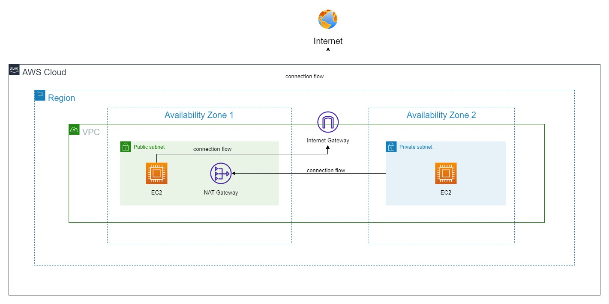

# Windows On AWS Series
---
## Forewords

In this Windows On AWS Series, we will start to explore AWS Service in which can help us to plan, to deliver and to deploy Windows and its services on AWS. We are not going to jump; however, we are going to do step by step from the very basic like how we eat daily to the very advances that i do not even know what i am writing about.

There are some concept i will repeat, incase it is neccessary; however, there are some that i will not cover/repeat because i understand that you are clever more than enough to catch up the technology. 

Moreover, if you have something unclear, you can find this starter section and go throught again and/or use Bing / Google. 

Trust me, to work in technology field, searching; in general, is an advanced skill that need to be polished. Search and found what you need, consider whether to implement or not and so on

Additionally, searching when/while working with the cloud (tech-cloud, not that cloud) is very crucial because there are so manything that even AWS document will not cover. It is case-by-case and solve-by-case. There are so many solution for a specific issue.

---
## I. What is AWS
AWS is stand for Amazon Web Service. Priority, AWS was not used public, it is rather than an in-house datacenter of Amazon to help to serve for the internal traffic and workload. 

At the end of the day (i did not know which day, but yeah), Amazon thought about to public AWS for world-wide usage and we have AWS nowawday. 

Visit the link if you found some interested in the history of AWS. Link: [History of AWS](https://en.wikipedia.org/wiki/Timeline_of_Amazon_Web_Services)

## II. Basic Concept
Please understand that, i am not going to go through more than 2000 (two thousands) AWS Services. Instead, i will only go throught what we are going to use in the Windows On AWS Lab Series

To begin with, we will start to look at the chart bellow to have an overview about AWS Services. 

We will go through from inside to outsite, they are as followed:

#### 1. Component / AWS Services
- EC2 : Stand for **Elastic Cloud Compute**, we call a single EC2 is an instance. This is a virtual server which is dilivered by AWS from the AWS physical underlied hardware. There are so many type of EC2 such as (listed some): 
    - General Purpose: use for some of general usage
    - Compute Optimized: use for computational tasks which is required high CPU processing due to heavy work-load
    - Memories Optimized: use for fast performance for workloads that process large data sets in memory
    - And some more other instance type which you can find here: [AWS Instance Types](https://aws.amazon.com/ec2/instance-types/) 
- NAT Gateway **(NGW)**: this is a network-based service that provided by AWS to help the other services that inside a private network can connect to the internet. NWG is often provisioned and deployed inside a Public Subnet
- Internet Gateway **(IGW)**: this is also a network-based service that managed by AWS to help all of the services inside a VPC (AWS Local) to be able to connect to the internet. An IGW is always attached to a VPC. We cannot deploy the same IGW to another VPC, If we want another VPC to be able to connect to the internet, we have to provision another NEW IGW and then attach it to the desired VPC that we want to.
- Public and Private Subnet: this is provisioned by AWS SDN (Software Defined Network). The subnets, in general, has been already done IP-Subnetting by AWS. Hence, our tasks is to plan to deploy the subnet which is suitable our needs.

> **_NOTE:_**  
	    There are some differences between Public and Private Subnet:  
        - Public Subnet: is connected to IGW and to be able to connect to the internet  
        - Private Subnet: IS NOT connected to IGW and cannot access to the internet  
        - To make the Private Subnet is accessible to the internet, we need to connect the whole disired Private Subnet to a NGW which is provisioned and deployed inside a Public Subnet
    
> **_NOTE:_**  
    - There is NO REAL Public Subnet. All Subnets are completely private after provisioned.   
    - A Public Subnet is a Private Subnet which is attached an IGW into it

- VPC: stand for **Virtual Private Cloud** this can be understood as a De-militarly Zone (DMZ) which is deployed based on the underlied AWS infrastructure as a service (IaaS) and provisioned to AWS customer (us) to use. By AWS definition, All VPCs are completely private, that means, a VPC is logically separate your infrastructure. Hence, this is let us understand more the reasion why there is NO REAL Public Subnet.

> **_NOTE:_**   
    If there were 2 VPCs that deployed at the same AZ and same AWS Region, they are still completely private and cannot be connected to each others. Unless, we setup some special services and connect 2 VPC. Then, they will be able to communicate to each other. 

- Availability Zone **(AZ)**: this is a physical datacenter in which can be understood as an AZ. It presents the available of AWS Services. This is spread-out zone by zone. An AZ is located inside an AWS Region. From the chart, we can see that AZ 1 and AZ 2 which mean that our service is deployed into 2 different datacenter in the same region 
- AWS Region(s): They are the physical places where Amazon build the Datacenters and make them become aailable for usage. An AWS Region can have at least 1 AZ and at most 4 AZ (continue to growth)
- AWS Cloud: This is virtually understands that all of the services that we deployed will belong / inside Amazon Web Service
- Internet: global internet (0.0.0.0/0)

#### 2. Connection Flow
Let's take a closer look to the diagram, we will see some arrows which are named **Connection Flow**. They are the flow of the network inside a VPC.

Please understand that in the future labs, i am not going to name the arrow anymore. This is due to the first and basic AWS so that i named those arrows for us to understand. This is also not neccessary to name, but the most importantly is the direction of the arrow point to, not the name. 

If you search around the internet for AWS Diagram, those arrows are not named, but the direction they pointed to will tell the jobs. Hence, just for very first basic lab purpose.

To explain about the connection flow, as followed
- All of the services inside a Private Subnet will not be able connect to the internet. Hence, the services inside a Private Subnet will be connected and driven to the NAT Gateway
- From NGW, all the connections which are driven will be able to connect to the internet
- As mention above, there is No Real Public subnet. Hence, the Public subnet which presented in the diagram is a Private Subnet in which deployed / linked an IGW and make it become a Public Subnet.
- All of the services inside a private subnet go to the internet through out an IGW
- IGW will be attached to the VPC for internet accessible
- 

