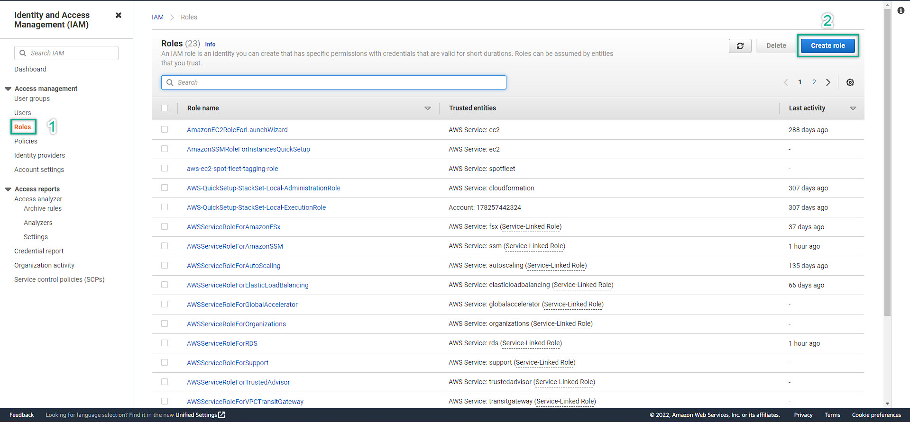
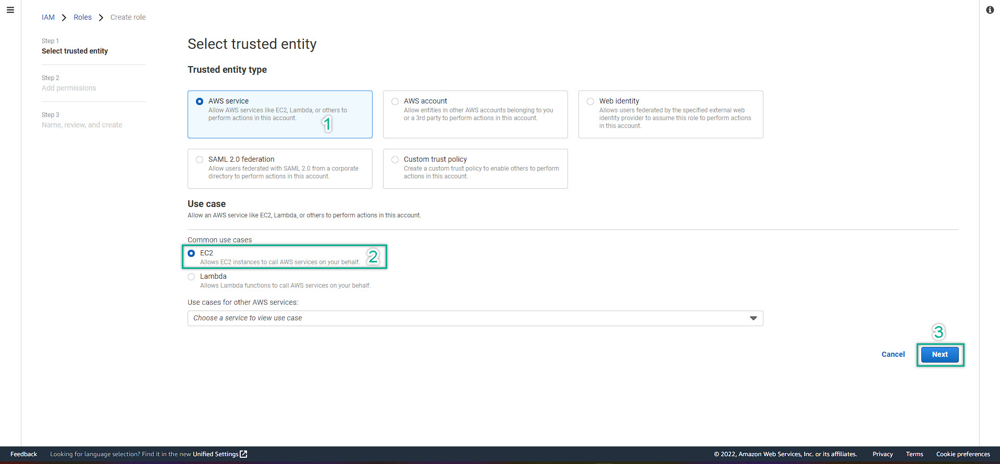
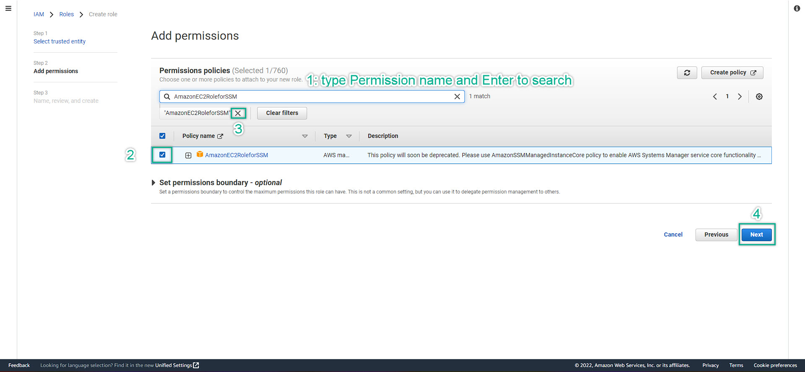
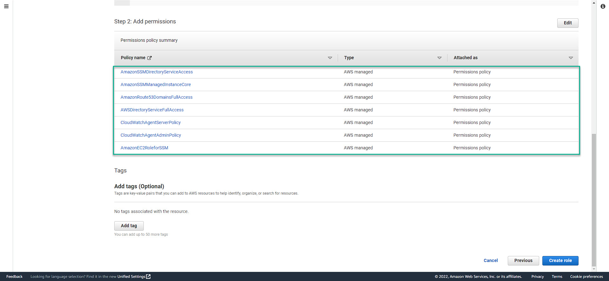
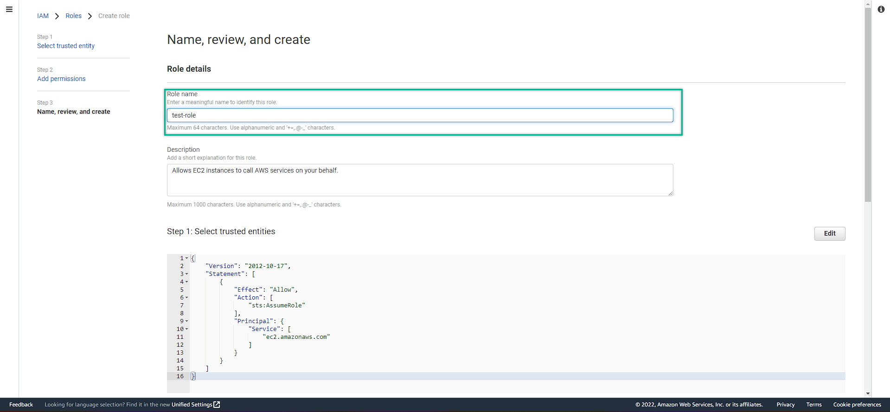
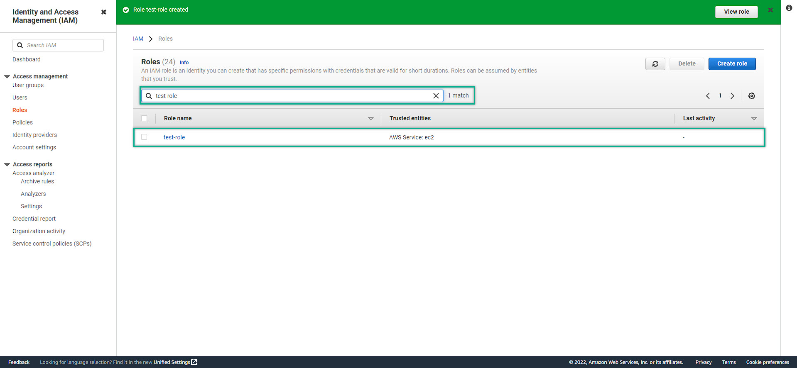
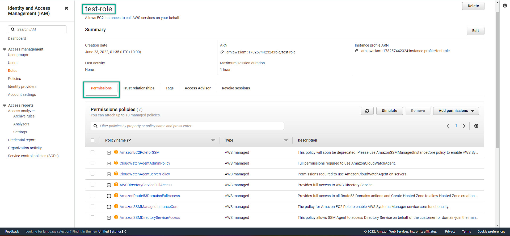

### Forewords
If you have not ready yet to deep dive into the Windows On AWS, take your time to prepare yourself by doing those labs to make sure that you are up to date with the cloud
- [Creating Your AWS Account](https://000001.awsstudygroup.com/)
- [Setting up Budget for your Cloud Journey](https://000007.awsstudygroup.com/)
- [VPC - Virtual Private Cloud - Introducing and Getting to know](https://000003.awsstudygroup.com/)
- [EC2 - Introducing and Getting to know](https://000004.awsstudygroup.com/)

Once you have done all of those labs, i understand that you are ready to deep dive into the cloud. Let's get your hand dirty ! 

----

#### I. Create IAM Role
- IAM - Identity Access Management: This can be considered as a permission which is grant access for users and/or aws resources to perform tasks. IAM best practice is to grant least privilege to users/aws resources. We can also grant permission that denial some tasks on specific users / aws resources
- AWS Management Console => Search Box => search for IAM service 
- IAM Management Console => Role => Create Role
   
- AWS Service => EC2 => Next
   
- Search for AmazonEC2RoleforSSM => mark the box. Then continue to search for the rest of following roles:
- Remember to delete the found-out permission before to continue to search again. If not, it will be conflicted and cannot search out the next permission we need
  
- The required permissions:
  CloudWatchAgentAdminPolicy; 
  CloudWatchAgentServerPolicy; 
  AWSDirectoryServiceFullAccess; 
  AmazonRoute53DomainsFullAccess; 
  AmazonSSMManagedInstanceCore; 
  AmazonSSMDirectoryServiceAccess
- Then click Next, srcolling DOWN to see those selected permissions
  
- After checked all the required permiosions and make sure that they are all added. Scrolling UP again and start to name your role
  
- After done checking and naming your role. Click Create Role at the bottom
- To check your custome created role, Roles => search the role name that you created
  
- Click the new created role to see
  
- We have done create role to prepare for our Windows Server on AWS
  
