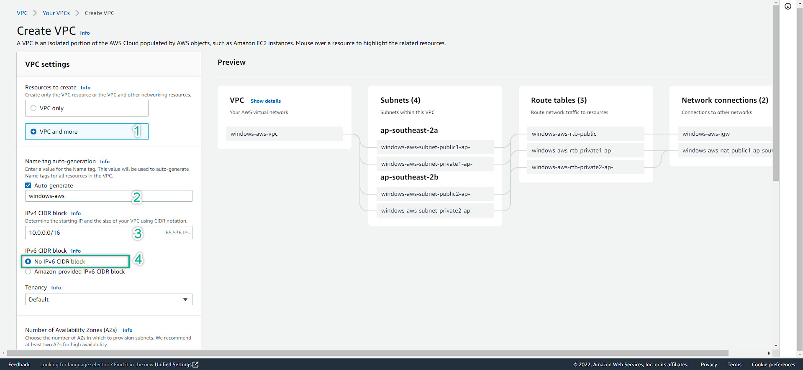

### Create VPC

In this section, we will create a VPC. Something need to understand before deep-dive into a VPC:
- AWS recently has been developing new VPC Management Console. Hence, pay attention to the top of your browser to see if there is anything inform from AWS. Click to switch to new VPC Management Console
- New VPC Management Console will help you to create: Subnet, Route table and associate the route for you, NAT Gateway, Internet Gateway at the same time
- The old VPC Management Console does not let you do that, it is only create vpc and subnet. You have to manually create route table and associate the route. Moreover, you have to create Internet Gateway, NAT Gateway and attach to VPC and Public subnet (coresponding)
- The New VPC Management Console which is friendly and quick. However, if you are new into AWS, using the old console will be good because it will force you to play around the VPC services so that you have chance to understand more about the AWS.
  
---
### Steps to create a VPC
1. If your are already at AWS Management Console => Search Box => VPC
2. At VPC Management Console => Check to see if you are in the right region. If not, change to your desired region. Then on the left menu, click Your VPC
  
3. Click Create VPC
  
4. Choose Create VPC, subnet, etc. Follow the steps in the picture bellow.    Then, continue to scroll down
  
5. Continue to configure VPC. Follow the steps in the picture bellow
  
   - Then, click Create VPC
   - It's takes sometime to deploy all of the required resources. Roundly, 3 minutes
  
6. Resources successfully created. Click View VPC
  
- Click Subnet to see those created subnet. You can also create your own subnet here by clicking Create Subnet (top right)
  
- Checking the created Route Tables. You can also create your own Route Table here by clicking Create Route Tables (top right)
  
- Checking the created Internet Gateway (IGW). You can also create your own IGW here by clicking Create IGW (top right)
  
- Checking the created NAT Gateway (NGW). You can also create your own NGW here by clicking Create NGW (top right)
  
