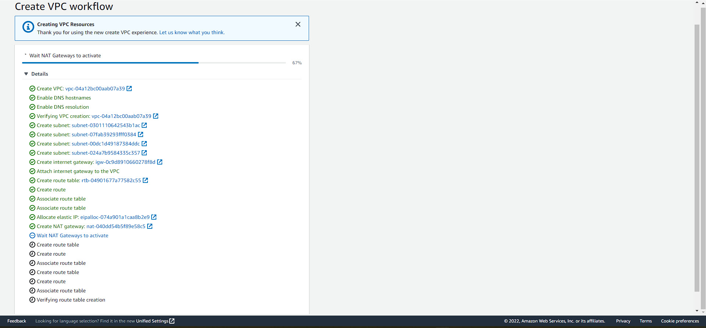

### Create VPC

In this section, we will create a VPC. However, before to continue there are some note that your need to know
- AWS recently has been developing new VPC Management Console. Hence, pay attention to the top of your browser to see if there is anything inform from AWS. Click to switch to new VPC Management Console
- New VPC Management Console will help you to create: Subnet, Route table and associate the route for you, NAT Gateway, Internet Gateway at the same time
- The old VPC Management Console does not let you do that, it is only create vpc and subnet. You have to manually create route table and associate the route. Moreover, you have to create Internet Gateway, NAT Gateway and attach to VPC and Public subnet (coresponding)
- The New VPC Management Console which is friendly and quick. However, if you are new into AWS, using the old console will be good because it will force you to play around the VPC services so that you have chance to understand more about the AWS.
  
---
- If your are already at AWS Management Console => Search Box => VPC
- At VPC Management Console => Check to see if you are in the right region. If not, change to your desired region
  
- Click Create VPC
  
- Choose Create VPC, subnet, etc
  
- Name your VPC
- Choose your IPv4 CIDR Block, AWS will use SDN (Software Defined Network) to do ip-subnetting for us
- For IPv6, please refer to the info hyperlink. By default, No IPv6 CIDR Block
  
- Choose AZ: 2
- Number of Public and Private Subnet: 2 => this is a common best practice on AWS for load balancing, fail-over, always-on and high availability of AWS services
- If you need more subnet, you can choose 4. However, for the lab, 2 is enough.
- If you pay attention to the subnet which is recommended by AWS, there are always even number due to infrastructure best practices which i mentioned above
- You can customise your subnet by choosing 0. Then, manually create them as your desired.
-  NAT Gateway: in 1 AZ
-  VPC Endpoint: NONE
-  DNS Option: by default on the NEW console, they will be checked. However, if you create on old console, you have to manually choose the VPC and enable them.
- Double check all of the option 
- Then, click Create VPC
- It's takes sometime to deploy all of the required resources. Roundly, 3 minutes
  
- Resources successfully created. Click View VPC
  
- Click Subnet to see those created subnet. You can also create your own subnet here by clicking Create Subnet (top right)
  
- Checking the created Route Tables. You can also create your own Route Table here by clicking Create Route Tables (top right)
  
- Checking the created Internet Gateway (IGW). You can also create your own IGW here by clicking Create IGW (top right)
  
- Checking the created NAT Gateway (NGW). You can also create your own NGW here by clicking Create NGW (top right)
  
