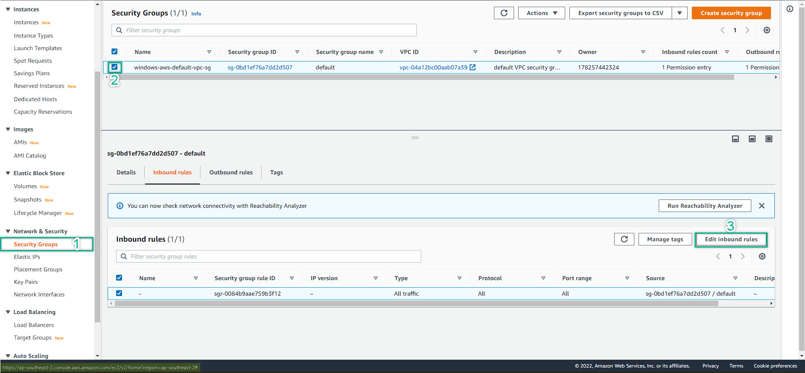

- To gain access to our instance, we need to understand that we have 2 instance: 1 deployed at Public Subnet, 1 deployed at Private Subnet
- Navigate to VPC Management Console => Left hand-side menu => Security Group => Double check that your VPC ID is matched with the created working-on VPC
- Then choose the right security group => Inbound => Edit Inbound Rule 
  
- Add Rule => All Traffic (ONLY FOR LAB PURPOSE) => 0.0.0.0/0 => Save Rule
  
- Navigate back again to EC2 Management Console => Instances => Choose jumphost => Click Connect at top right 
  
- Choose RDP Client => Click Get Password => Browse your keypair => Decrypt Password => save the password
  
  
- Back to the instance console => choose jumphost => Details tab => copy the Public IP 
  
- Paste to your remote desktop client (already built-in in windows) => click connect => you will be prompt for account and password: 
- Account: Administrator (this is the default for most of Windows instances)
- Password: paste the decrypt password above. Password IS NEVER the same for all the EC2 instances. It does not matter that your instance in the same subnet or az, the password is always different between the ec2 instances
- This is a fully working Windows Server on AWS. The Windows Server is fully functional and not difference from your on-premise system
  

