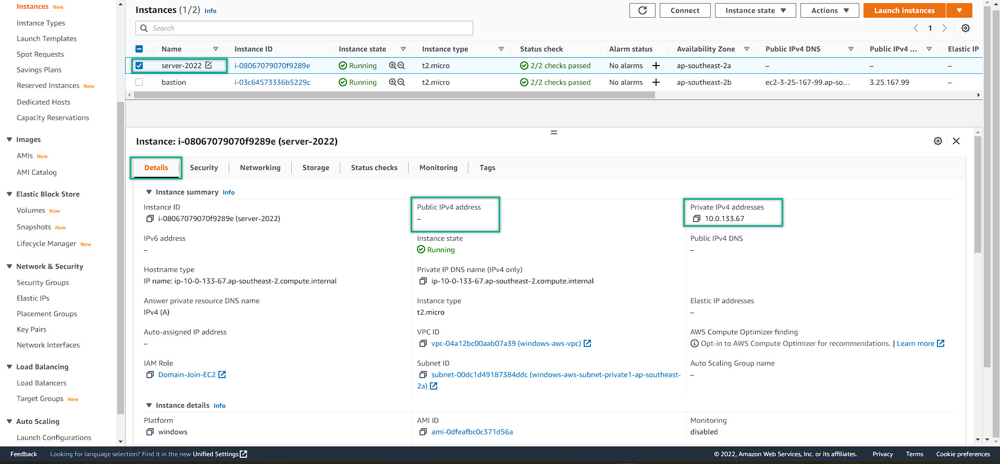
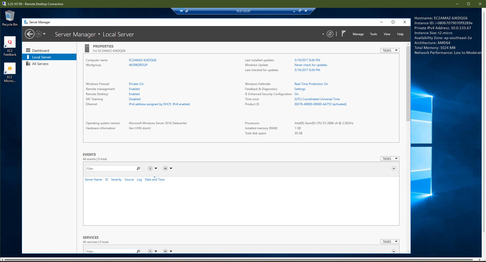

### Access to EC2 Private instance

1. Back to the EC2 Console => choose a private instance 
2. Decrypt password as same as before we did for the public instance. Remember to  save both password and private ip of the private instance
  
- However, we cannot connect from our place as we did on the public instance
- To pay attention that there is NO Public IP. ONLY Private IP is available. 
- at the **logged-in** public instance (bastion host) 
- It is a fully working windows server. So that, just search for the remote desktop service
- Connect with same default account and the saved decrypt password OF the private instance
- Connected to private instance successfully
  

---
We are finished getting to know with Windows On AWS.
