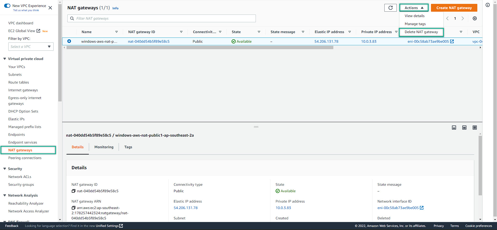
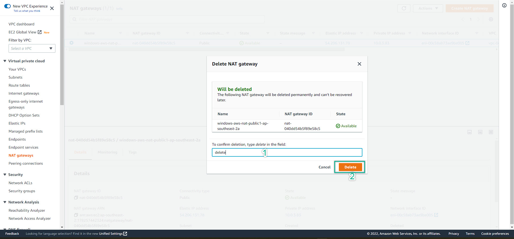

### Cleaning up the resources

1. EC2 Management console => Choose Instances => Click to choose All Instances => Choose instance state => Terminate

2. For the lab purpose, just click Terminate

3. Pay attention to Instance State, it will change from **Shutting down** to **Terminated**. Once the instance state at Terminated, this is mean your instance(s) has completely deleted => **No Extra cost** will be charged from now.
  

    - **If there were ONLY Stopped at instance state, which mean you still be charged for storage service due to the attached EBS (Elastic Block Storage)**
    - **Carefully choose the right option depends on your need if you would like to STOP or TERMINATE the instance(s)**
  
4. Navigate to VPC management console 
   - Route Table
   - Choose Public Route
   - Remove the IGW (internet gateway) from the public route
  

5. We do the same thing for the Private routes. However, we will remove the NAT Gateway. Do for both our private routes

6. Removing the NAT Gateway

    - It takes a while (3 mins) for the NAT Gateway to be deleted
  

7. Removing Internet Gateway
   - Detach IGW from VPC
   - Delete Internet Gateway

  

8. Deleting VPC
   - Navigate to VPC 
   - Choose the VPC you want to (need to) delete
   - Action => Delete VPC => Confirm Delete
   - As can be seen, everything included the route tables, subnets and vpc will be deleted
  
  

9. Deleting Elastic IP
    - If you left the Elastic IP UN-USED => you will be charged for the IP service
    - If Elastic IP is IN-USED => you will not be charged
    - Choose the right Elastic IP that need to be deleted
  

---

## Finished all cleaning up the services. Do not forget this step, otherwise, you will be charged for the AWS Services

