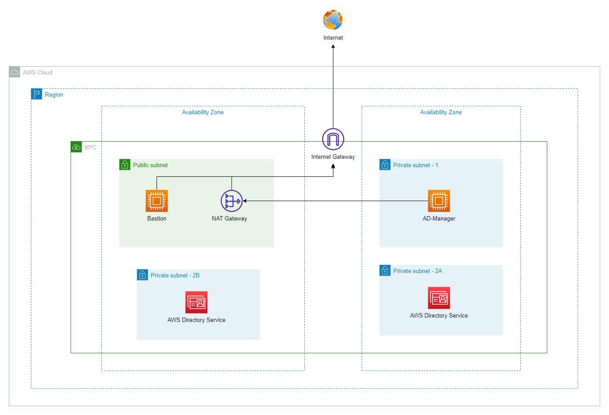

**AWS Managed Directory Service - Understanding** 
- AWS Managed Directory Service is the service which is built by AWS underlying infrastructure. Once we use this service, AWS will create a host server, then deploy the Windows Server and promote it to become an Active Directory service (AWS Managed AD)
- By AWS Share Responsibility, we are AWS's user. Hence, we do not have permission and do not have to take care about the underlying AWS Directory Service host. 
- What we need to do is to deploy the service and managed it via a Windows Server which is joined into the AWS Managed AD and install Administrative Tools to perform the tasks
- **There are some benefits about AWS Directory Service (AWS Managed AD):**
  -  We do not have to take care about the Directory Service host which could  become silence due to End of Service. Generally, we do not need to care about the hardware components, AWS will take care that
  -  Eliminate manually / script adding computer to join into domain. By using AWS IAM, new created servers / clients will automatically join into domain after successfully launched
  -  AWS Managed AD is always deployed under High Availability, which mean you cannot create AWS Managed AD with a single subnet. Multi Subnet and Multi Availability Zone (at least 2) are always required to deploy AWS Managed AD.
  -  AWS Managed AD is still able to co-op with on-premise Active Directory in case of hybrid cloud infrastructure in used.
  -  AWS Directory Serivce provides both Standard and Enterprise services so that to suitable the business's needs
  -  AWS Managed AD is also provide Domain Verification service to verify on-premise Active Directory. Additionally, on-premis infrastruture can also use AD Connector which is a service that provided by AWS to connect from on-premise AD to AWS Managed AD. For more information about AWS AD Connector, please refer to this link: [Getting Start with AWS AD Connector](https://docs.aws.amazon.com/directoryservice/latest/admin-guide/directory_ad_connector.html)
- **Some information need to be cleared when using AWS Managed AD**
  - By AWS Sharing Responsibility, as AWS's users, we cannot manage the underlying host which is used to host the AWS Directory Service
  - We need to understand the Group type, the most two common group of AWS Managed AD are: Delegated Group and a Normal Group
  - What is Delegated Group on AWS Managed AD: this is the group that is grant permission to use and managed AWS Managed Directory Service. For those of users in side this group (Administrator for example) has fully permission to perform Administrative Tasks on the Directory Service. 
  - Take a note that this group is created by AWS underlying service and delegated to us with some built-in power users such as: Administrator, Enterprise Administrator, Domain Administrator, etc. 
  - What is Normal Group: this is the group that do not have any permission to managed the AWS Managed AD. Such as User group
  - 
**Detailed Infrastructure Explanation** 
 
- EC2 - Bastion Host: used as a remote desktop gateway (RDGW) which is deployed inside a public subnet. So that, we will use this instance to remotely connect to the private subnet
- EC2 - Windows Server 2022 - AD Manager: an EC2 instance which is running Windows Server 2022 and joined into the AWS Managed Domain. On this server, we will install some Administrative Tools in order to be able to manage AWS Directory Service. Such as: Active Directory User and Computer, DNS, Group Policy Management, etc.
- AWS Managed Active Directory Service: This is an AWS Directory Service which is deployed and promoted to be a Active Directory (AD)
