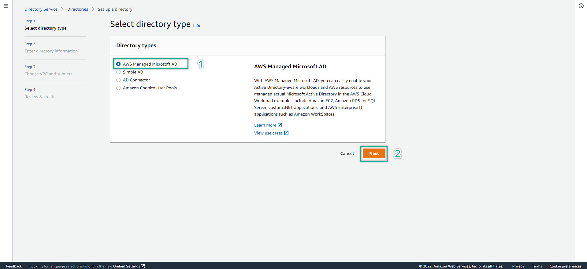
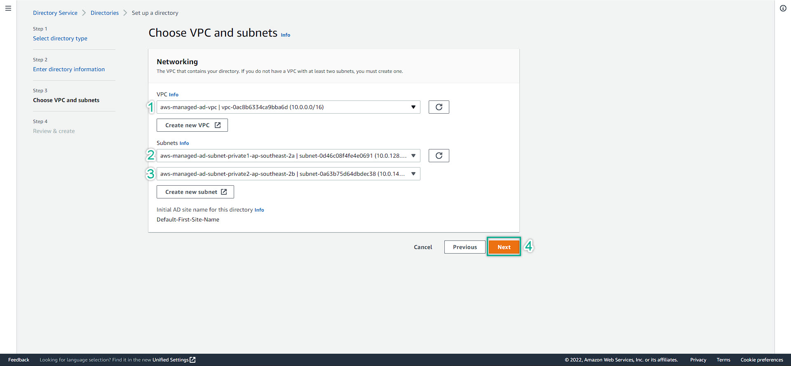
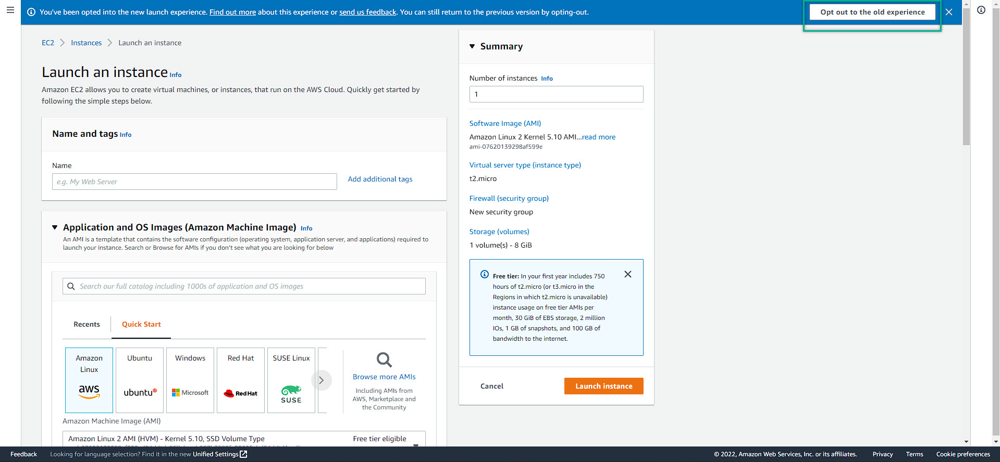

- If you have not ready for the infrastructure, please refer to this link for basic setup: [Basic Windows On AWS](https://github.com/minhhung1706/Windows-On-AWS-Series/tree/main/Windows-On-AWS-Basic)
- Let assumed that you are fully prepared to deep-dive into AWS Services - AWS Directory Service
- Reminding about the basic setup to prepare for deploying the AWS Managed AD:
  - VPC, Subnet, Internet Gateway, NAT Gateway must be created
  - Availability Zone must be from 2 zones and more
  - IAM Role with all of neccessary permissions must be created
  - Your AWS Account should have enough permission to perform this lab. Recommended to use your own AWS Account
---
### Deploy AWS Managed Directory Service
- AWS Management Console => Search for Directory Service
- At AWS Directory Service management console => Set up directory
  
- Choose AWS Managed Microsoft AD => Next
   
- Depends on your business needs. Manually choose the right Directory Service. For this lab purpose, choose Standard Edition
- Then, fill in all of required information: Fully Qualified Domain Name (FQDN), NetBios Name, Description (optional), password
- Note: By default, the AWS Managed AD account is Admin (case sensitive)
- Do not worry about the price, the lab last long 2~4hrs. Do not cost too much. However, remember to delete the resources included this Directory Service after completed the lab
  
- Then click Next
- Choose the right VPC and Subnet. Remember, at least 2 subnet in 2 different availability zone (az).
- Must be private subnet for security best practices. Then click NEXT
  
- Double check all of the required information => Create Directory
  
- The directory creation might take a bit long, roundly 40 minutes. 
- After finished, we will see our directory has been created
  
- We are done for setting up AWS Managed AD 
---
### Deploy EC2
- Let assumed that we are all know how to deploy EC2. 
- However, the basic guide has already mentioned about the EC2 Management Console
- The NEW EC2 Management Console is still under development. Hence, it will not let us join domain and some other setup
- Switch back to the OLD EC2 Management Console => Top right: Opt-out to the old experience
  
- This is the OLD UI which we familiar with
  
- Follow up the step 
- Choose / fill in the right option / information and click NEXT
- Remember to attach the IAM Role which have some of the required permissions to be able to work with Directory Service
  
- The EC2 should be:
    - 1 EC2: t2.micro | Bastion host | Public subnet | Auto-assign Public IP: Enable
    - 1 EC2: t2.micro | AD-Manager | Private subnet | Auto-assign Public IP: Disable
    - 1 ~ 2 EC2: t2.micro | Functional Server (your choice) | Private subnet |  Auto-assign Public IP: Disable
- Finally, we will have some running EC2 look like this:
  
- We are done for setting up EC2

