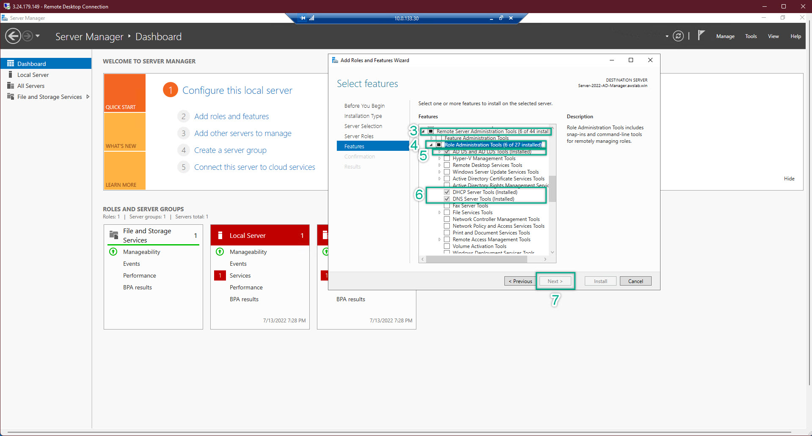

- This section will guide us how to configure EC2 so that all of EC2 which joined AWS Managed AD can be connected together. 
- Take note that, EC2(s) joined into AWS Managed AD do not mean they can connect to each other
- AWS VPC is extremely strict about security best practices. Hence, need some setup so that all of EC2(s) can communicate to each other
---
**I. Edit Computer Name (optional)**
1. Remote Log-in to your EC2 with domain log-in => Server Management => Double check that the server has already joined into domain. In fact, if you cannot log-in EC2 with domain admin. This is meanning for something wrong when setup EC2 Steps. Probably about IAM Role. 
2. Due to lack of permission / wrongly chose IAM to attach into EC2 => EC2 could not join domain => As a result, cannot log-in as domain administrator
3. After succeeded logged-in EC2 with domain logging => Server Management => Change Computer name
4. This step is only optional to make thing easy to work with. When we look at the machine, we know which server is doing which tasks. 
    
5. EC2 will be required to be restarted => just restart and then log-in again
6. Do the same thing on all of EC2
---
**II. EC2 Configuration**
1. Navigate to the AWS Directory Service management console => choose the created Directory Service => save the DNS Address
    
2. Navigate to the EC2 Management Console => save ALL of the both public and private ip address of ALL EC2
    
3. We will have a temporary notepad file like this
    
4. Edit your hosts file on ALL EC2. Remember, before edit the host file, you need to grand the permission so the that file can be saved. Host file is located at **C:\Windows\System32\drivers\etc**
    
    
5. The hosts file of all EC2 should look something like this
    
6. On ALL EC2. CMD => ipconfig /all to check the ip address. Then, configure the IP address so that matched with the what showed in the command line on EACH EC2. Because of we have already joined into the domain at the creating EC2 step. Then, the DNS will be pre-filled so that matched with our created AWS Managed Directory Service
    
    
    
    
    
7. At AD-Manager EC2 => Server Management => Add Roles and Features. After chose all the neccessary options => NEXT => Install => it might take 2 minutes 
    
    
    
    
8.  Restart ALL EC2 
9.  After restarted, login again and check ping in every server
---
**III. Server Communication Testing**
1. On each server, we perform to ping with both server name and server ip address to make sure that both ways communication are working perfectly on ALL EC2 server
2. Pay attention at my EC2 server name at the top right corner

3. Based on the ping result, we can confirm that all of our servers are working perfectly and be able to communicate with each others in both ways: by ip and by computer name
4. this will benefit for later work with the infradtructure

5. Get back to EC2 AD-Manager => Active Directory User and Computer => we will see that there is nothing different between Windows Server on-premise and Windows Server on AWS

   - AWS help us reduce the large amount of risky tasks
   - Especially the SDN (Software Defined Network) which assisted a lot in term of ip addressing
