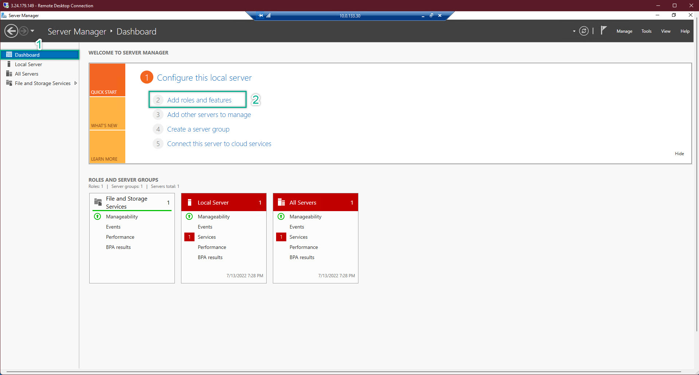

- This section will guide us how to configure EC2 so that all of EC2 which joined AWS Managed AD can be connected together. 
- Take note that, EC2(s) joined into AWS Managed AD do not mean they can connect to each other
- AWS VPC is extremely strict about security best practices. Hence, need some setup so that all of EC2(s) can communicate to each other
---
**Edit Computer Name (optional)**
- Remote Log-in to your EC2 with domain log-in => Server Management => Double check that the server has already joined into domain. In fact, if you cannot log-in EC2 with domain admin. This is meanning for something wrong when setup EC2 Steps. Probably about IAM Role. 
- Due to lack of permission / wrongly chose IAM to attach into EC2 => EC2 could not join domain => As a result, cannot log-in as domain administrator
- After succeeded logged-in EC2 with domain logging => Server Management => Change Computer name
- This step is only optional to make thing easy to work with. When we look at the machine, we know which server is doing which tasks. 
    
- Do the same thing on all of EC2
---
**EC2 Configuration**
- Navigate to the AWS Directory Service management console => choose the created Directory Service => save the DNS Address
    
- Navigate to the EC2 Management Console => save ALL of the both public and private ip address of ALL EC2
    
- We will have a temporary notepad file like this
    
- Edit your hosts file on ALL EC2. Remember, before edit the host file, you need to grand the permission so the that file can be saved.
- The hosts file of all EC2 should look something like this
    
- On ALL EC2. CMD => ipconfig /all to check the ip address. Then, configure the IP address so that matched with the what showed in the command line on EACH EC2
    
- At AD-Manager EC2 => Server Management => Add Roles and Features
    
- Next until Features => choose Group Policy Management
    
- Drop-down: Remote Server Administration Tools => Role Administration Tools => Choose as showed bellow => NEXT => It might take some minutes for server to install the chosen Administration Tools => After finished => restart the server
    
- Restart ALL EC2 
- After restarted, login again and check ping in every server
---
**Server Comminication Testing**
- On each server, we perform to ping with both server name and server ip address to make sure that both ways communication are working perfectly on ALL EC2 server
- Pay attention at my EC2 server name at the top right corner

- Based on the ping result, we can confirm that all of our servers are working perfectly and be able to communicate with each others in both ways: by ip and by computer name
- this will benefit for later work with the infradtructure

- Get back to EC2 AD-Manager => Active Directory User and Computer => we will see that there is nothing different between Windows Server on-premise and Windows Server on AWS
- However, AWS help us reduce the large amount of risky tasks
- Especially the SDN (Software Defined Network) which assisted a lot in term of ip addressing
