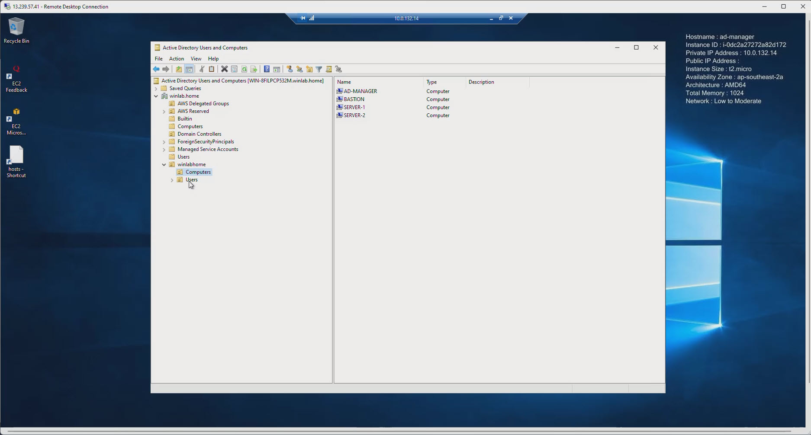
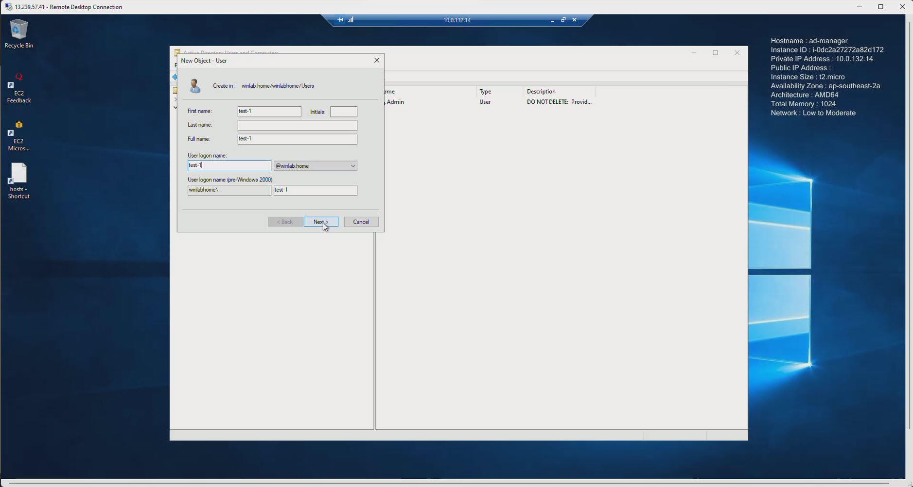
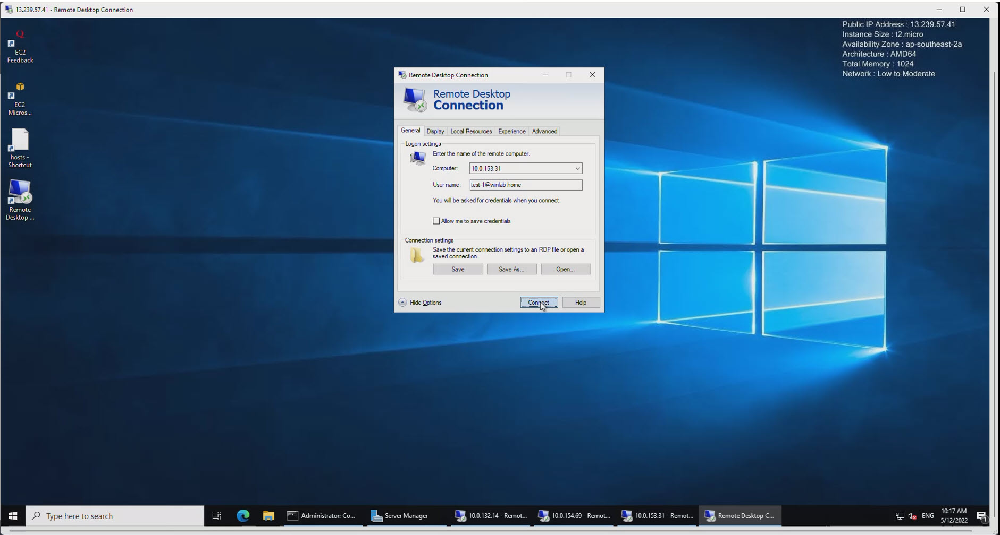
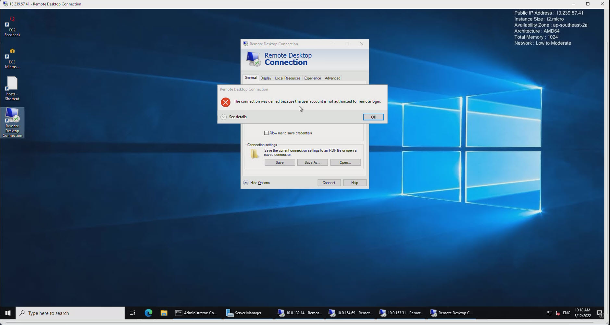
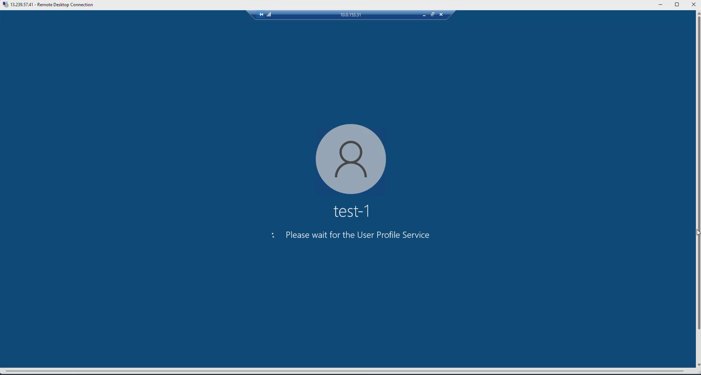
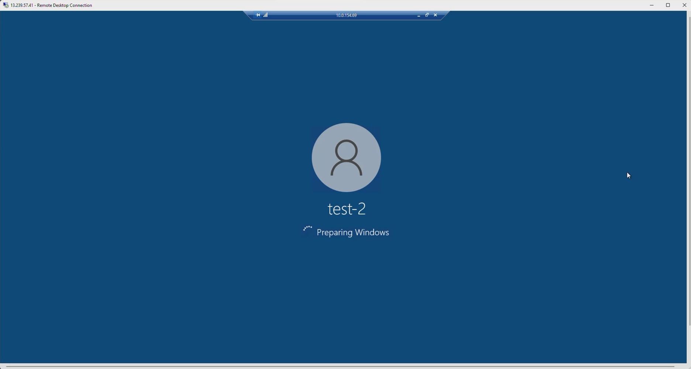

- Get back to EC2 AD-Manager => Active Directory Users and Computers => we will see that there is nothing different between Windows Server on-premise and Windows Server on AWS
- However, AWS help us reduce the large amount of risky tasks
- Especially the SDN (Software Defined Network) which assisted a lot in term of ip addressing
  
- At the EC2 Ad-Manager, we will try to create a new user
  
- After created a new user, we will try to log-in this user. This is also a domain user which is created on AWS Managed Directory Service
  
- By somehow, we encountered this issue
  
- This is not about the AWS Managed AD, it is all about the Windows Server Policy
- To fix this, we need to double check and Edit Local Security Policy on Windows Server
- Run => secpol.msc => Local Security Policy => Local Policies => User Right Assignment => Allow log on thrgouh remote desktop service => Check and Add Remote Desktop Users group
- Then log-in again will be succeeded
  
- Make another user and test 
  
---
- We have done setting up AWS Managed Directory Service and create an AD-Manager server to manage Active Directory Users and Computers. As can be seen, Windows Server on AWS help us to save our time and secure some risky tasks. 
- **Please remember to clean up all of resources after finished the lab to avoid unwanted charge for AWS Services**

