After finished all the parts of this lab. We will need to clean up the resources to avoid unexpected charge from AWS

---

**1. Clean Up AWS Managed Active Directory**
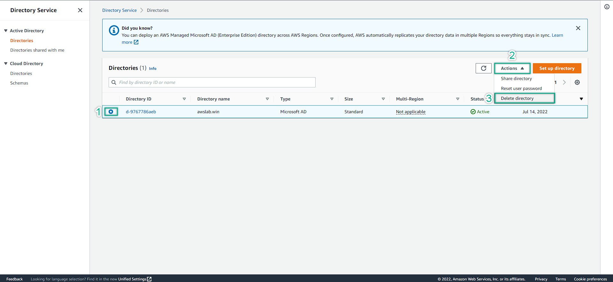
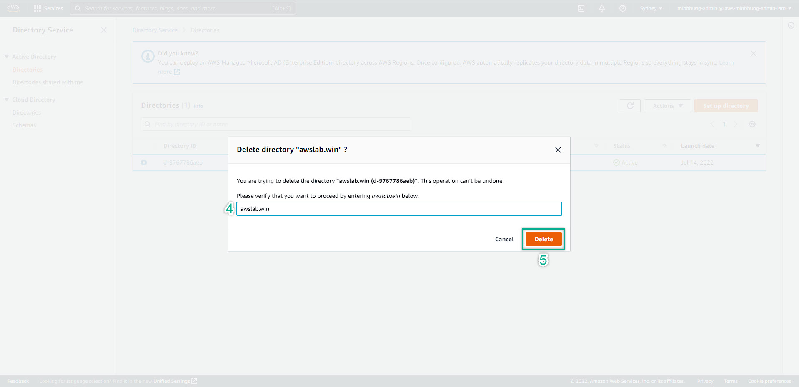

**2. Clean Up EC2**
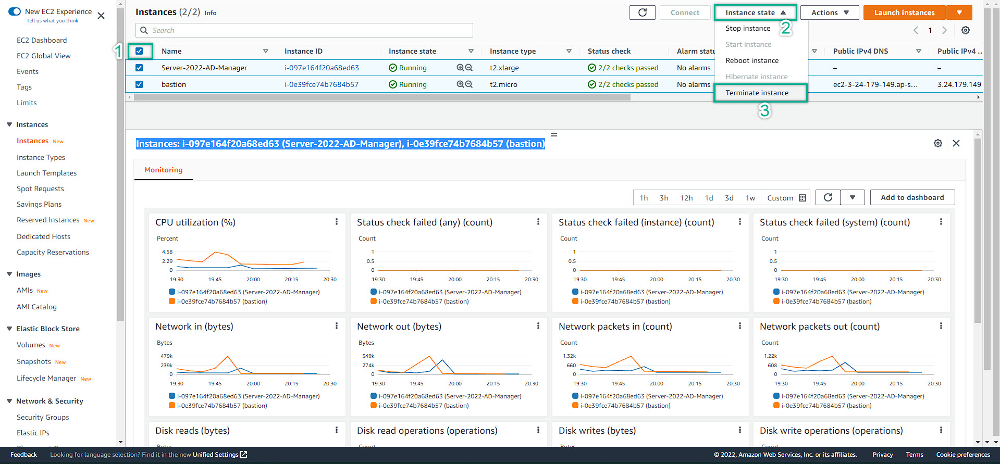
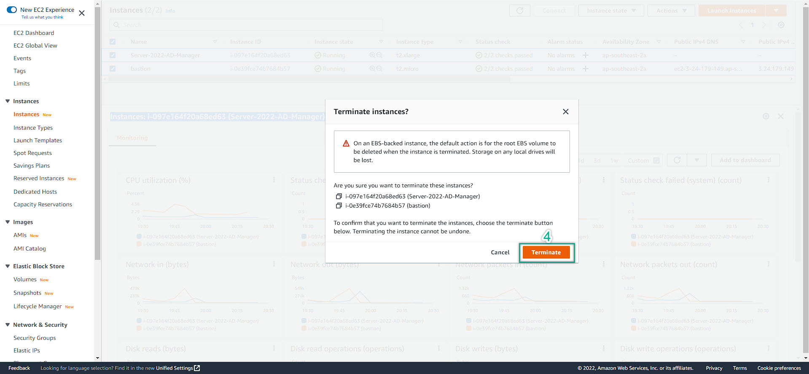
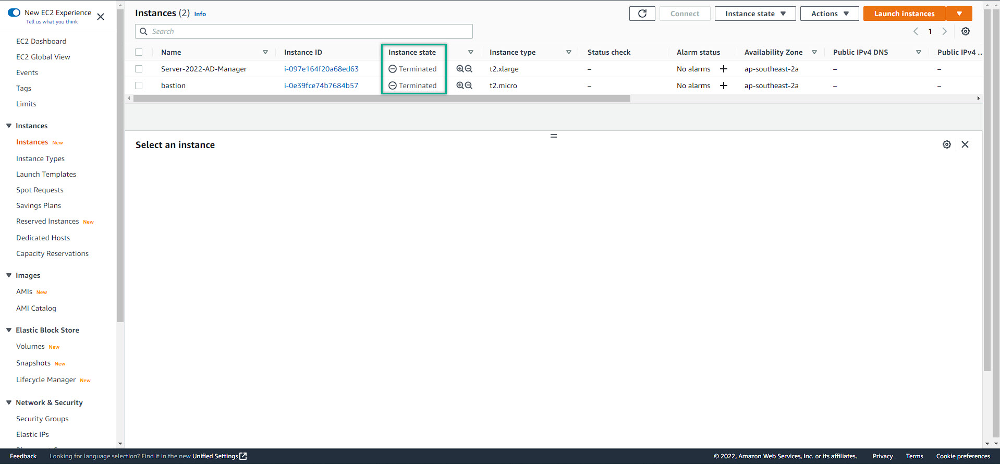

**3. Clean Up Security Group:**   
    - To be able to make all the service connectable, we did trust the Security Group Inbound Rule for both VPC-SG and d_Controller-SG (prefer to the basic guide)  
    - To be able to delete, we need to untrust (delete) those rule so that there is not any related-rule in a single security group  
    - We have 2 ways to delete the security group rules  
        ==> 1. To find the corresponded the security group id with the one we want to delete => Delete => Save  
        ==> 2. Delete all the presneted rule => Save  
    - Do for **ALL** security groups  
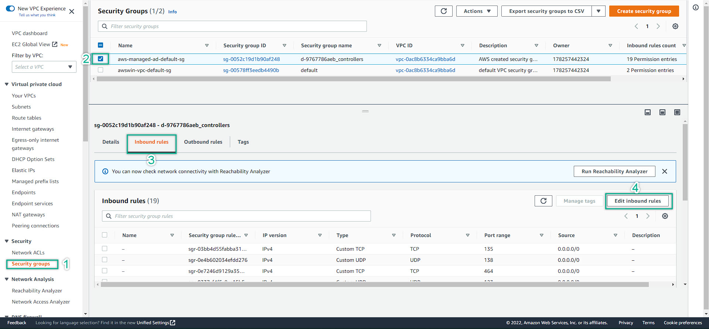
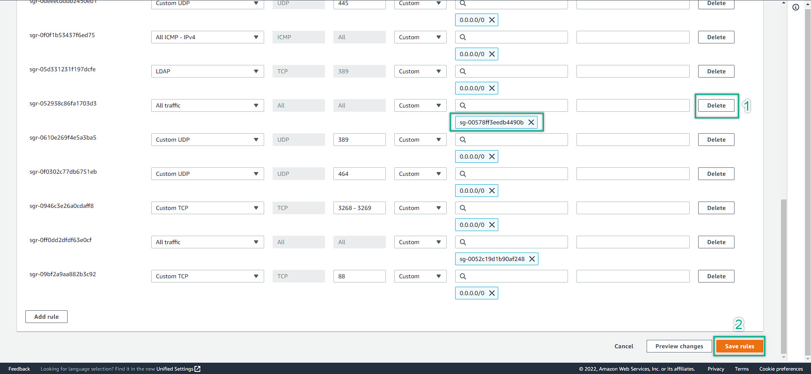
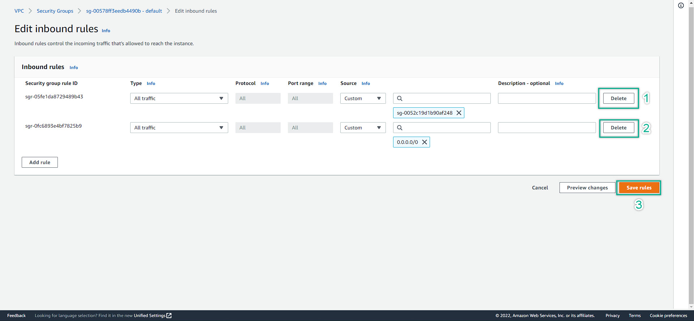

**4. Delete NAT Gateway**
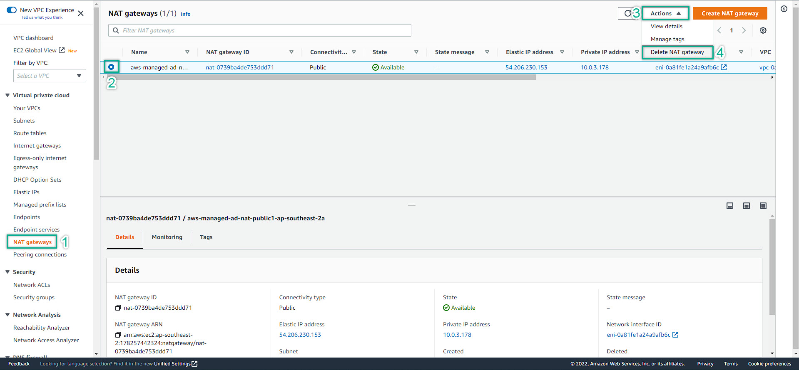
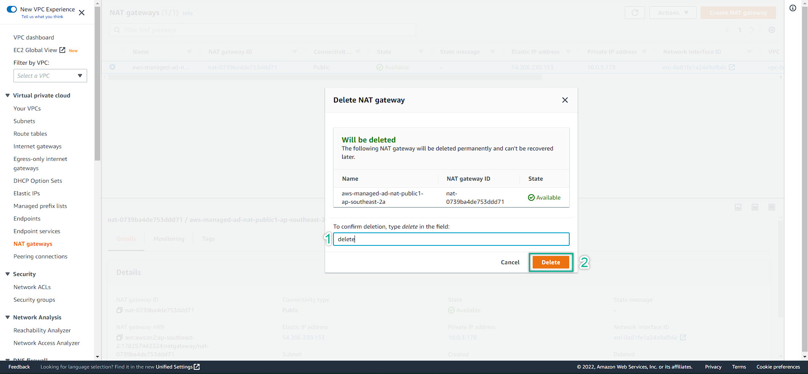
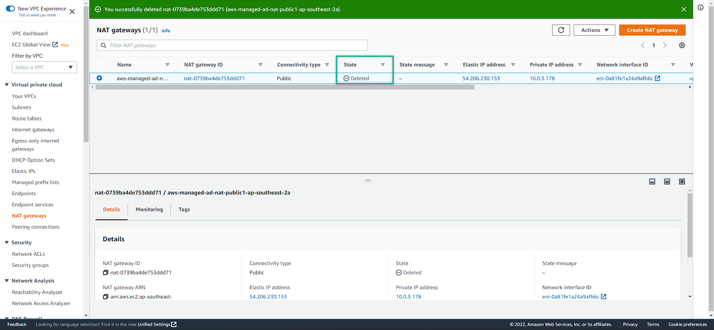

**5. Delete Internet Gateway**
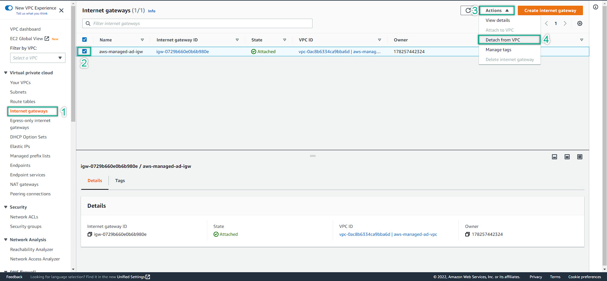
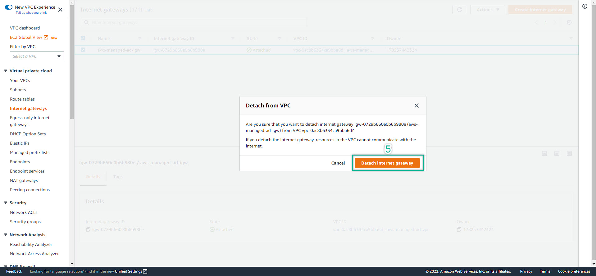
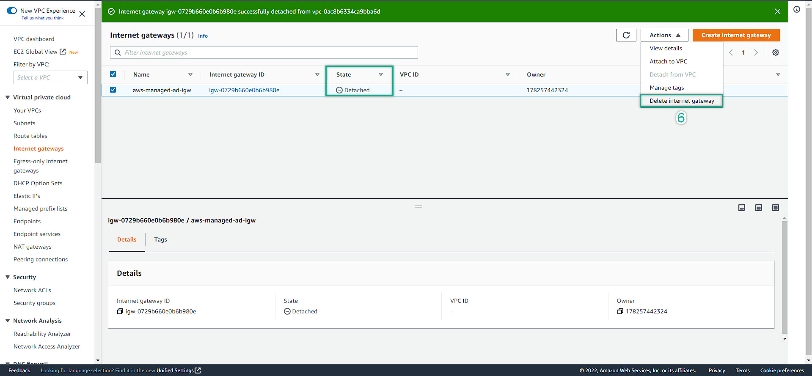
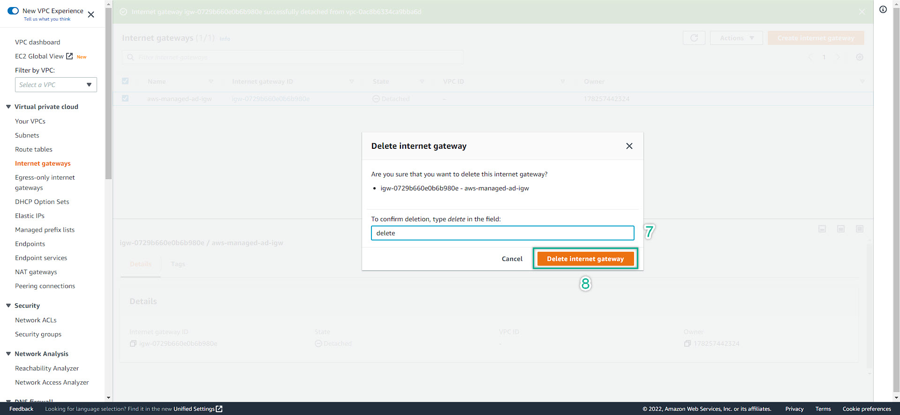

**6. Delete VPC**
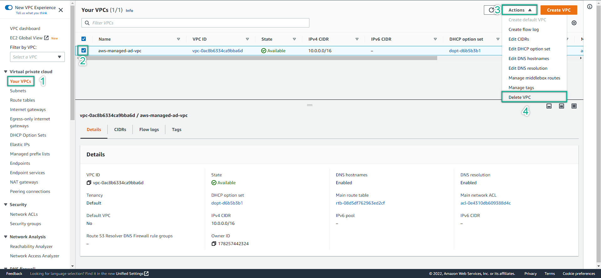
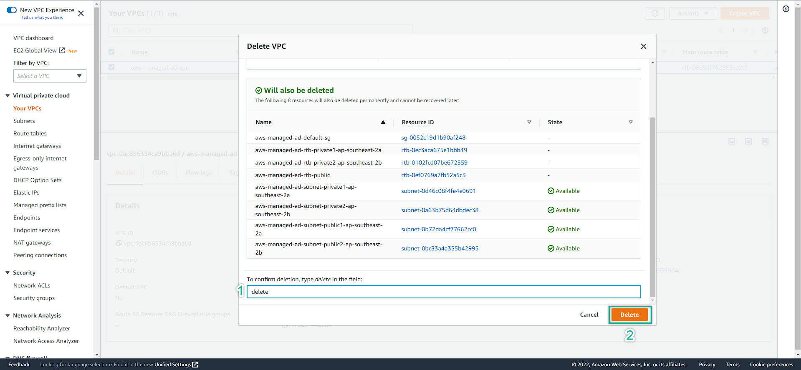

**7. Delete Elastic IP**  
If you left the Elastic IP un-used. You will be charged for the IP service. Hence, remember to delete all of Elastic IP if you did not need them.  
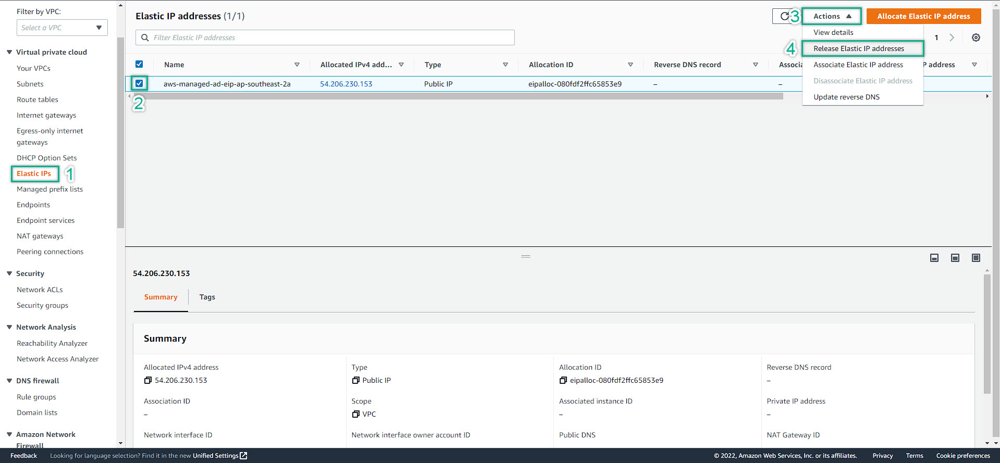
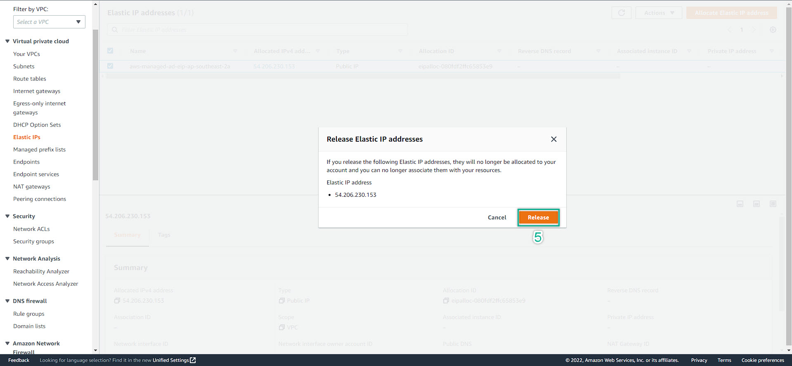