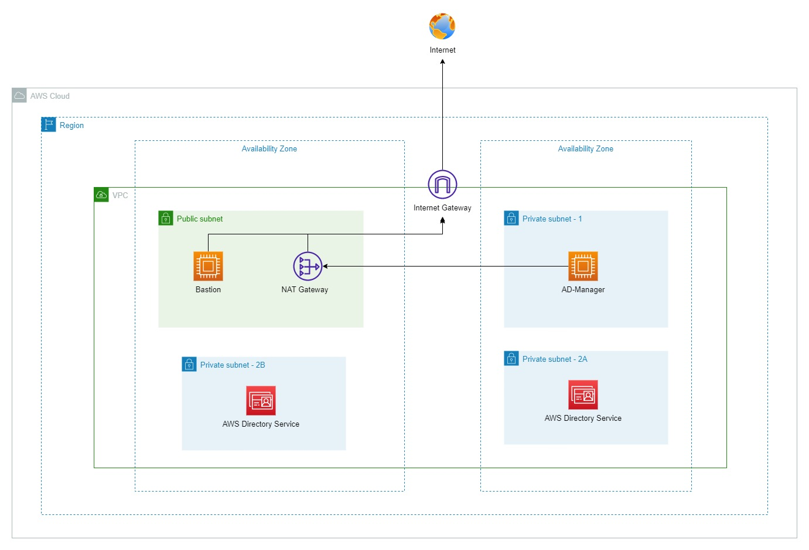

### Deploy AWS Managed AD
Your company has been planning to move the business's infrastructure to AWS. However, both CTO and CIO have been concerning about the Windows Server Active Directory Services. As a System and Network Engineer, you are tasked to research about the built-in AWS Directory Service. 

This lab will help you out about how to deploy AWS Managed Directory Service as well as how to manage AWS Directory Service

If you have not ready for the deep-dive into AWS Services - Windows On AWS. Please refer to this link for [Basic Windows On AWS](https://github.com/minhhung1706/Windows-On-AWS-Series/tree/main/Windows-On-AWS-Basic)

 
---
### Things to know
If you have not ready yet to deep dive into the Windows On AWS, take your time to prepare yourself by doing those labs to make sure that you are up to date with the cloud
- [Creating Your AWS Account](https://000001.awsstudygroup.com/)
- [Setting up Budget for your Cloud Journey](https://000007.awsstudygroup.com/)
- [VPC - Virtual Private Cloud - Introducing and Getting to know](https://000003.awsstudygroup.com/)
- [EC2 - Introducing and Getting to know](https://000004.awsstudygroup.com/)

Once you have done all of those labs, i understand that you are ready to deep dive into the cloud. Let's get your hand dirty ! 

