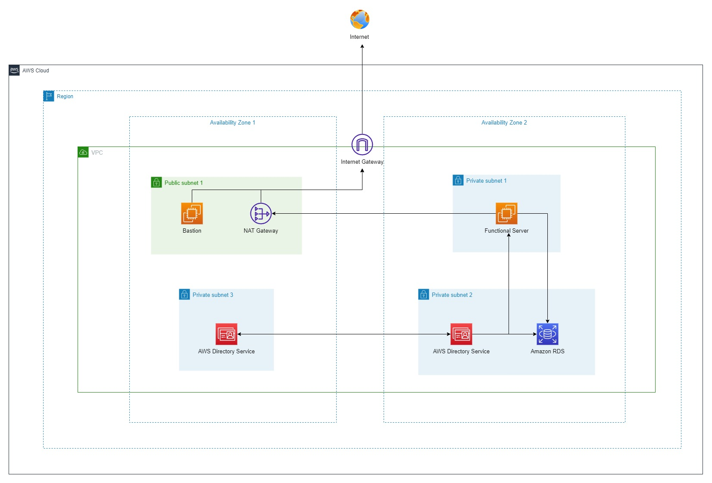

### Preperation
---

---
By analyzing the architect diagram, we will understand and have some preperation as follow:
- 1 VPC
- 1 NAT Gateway
- 1 Internet Gateway
- 1 Public Subnet
- 2 Private Subnet
- 1 AWS Directory Service
- 1 Amazon RDS instance: Microsoft SQL Server
- 1 EC2: Bastion | Public Subnet | Enable Public IP: YES | Joined AWS Managed AD: optional
- 1 EC2: Functional Server: AD-Manager & Database Service server (for lab purpose) | Private Subnet | Enable Public IP: DISABLED | Joined AWS Managed AD: YES