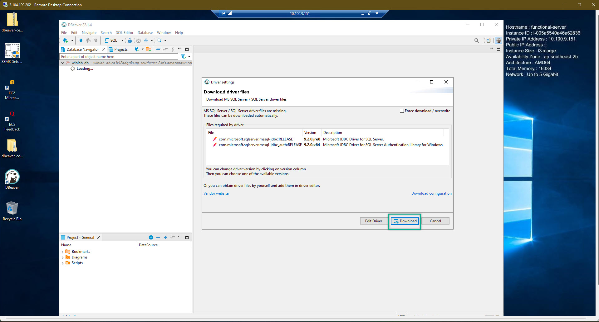

### Connect To Amazon RDS
---
1. To be able to connect into Amazon RDS, we need to download Microsoft SQL Server Management Studio and/or DBeaver
    - [Microsoft SQL Server Management Studio](https://docs.microsoft.com/en-us/sql/ssms/download-sql-server-management-studio-ssms?view=sql-server-ver16)
    - [DBeaver](https://dbeaver.io/)  

2. Install both Microsoft SQL Server Management Studio and DBeaver. Just do the installation task as same as the other software, nothing special. The reason why i listed 2 DB tools just because of making more choice for everyone to choose the most suitable one to work with  

3. After installed both of the Database connection tool. Open Microsoft SQL Server Management Studio
  

4. At the Object Explorer => Connect => Database Engine
  

5. Back to the RDS Management Console => choose the created databse => copy the database endpoint
  

6. Paste the End-point into the Server Name => choose the SQL Server Authentication => fill-in the user name and password => Click Connect
  

7. We connected to the Amazon RDS successfully
  

8. Right-click to Database => New Database => We are trying to create a new database to see double check the database is working perfectly

  

9. We created our test_db successfully
  

10. Close the SQL Server Management Studio. Open the DBeaver and do the connection to our Amazon RDS and double check if we see the test_db or not
  

11. Fill-in the information and click finished
  

12. We might be prompted to download some required data/file to be able to perform the connection. Just download them
  

13. We successfully connected to Amazon RDS by using DBeaver
  

