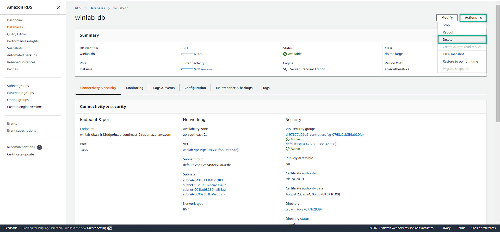
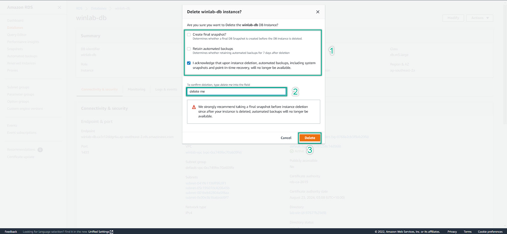
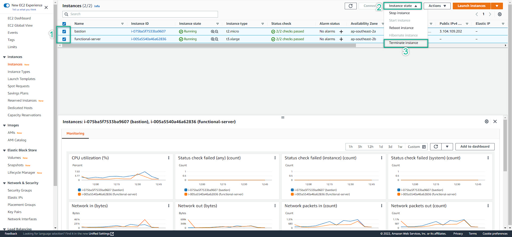
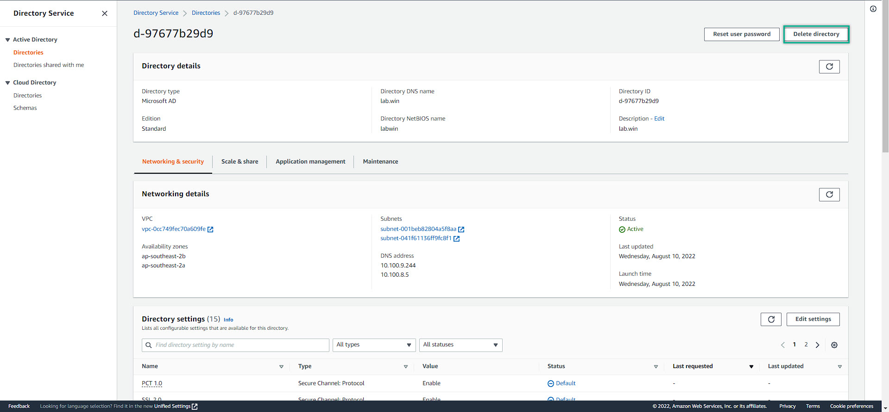
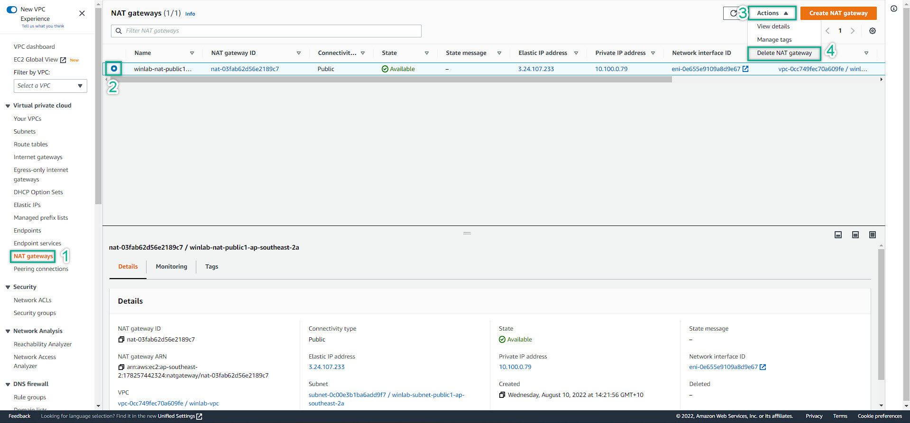
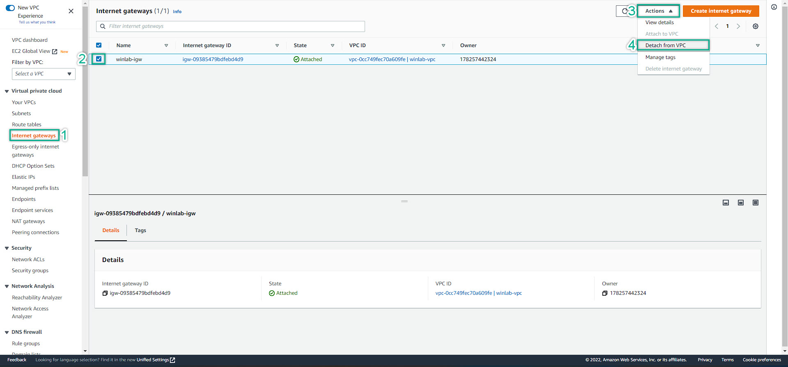
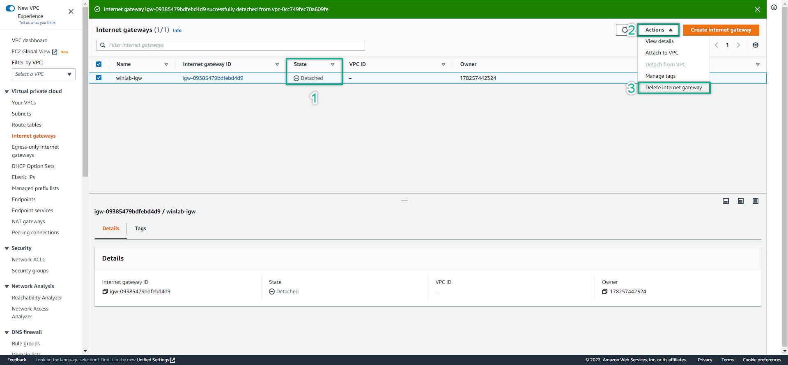
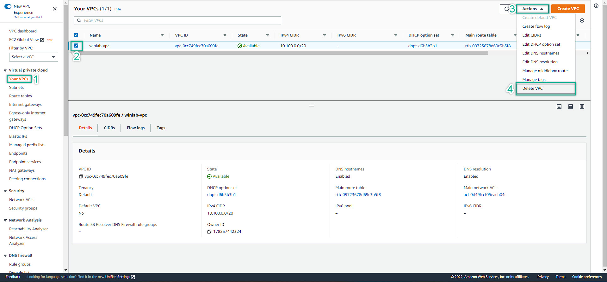
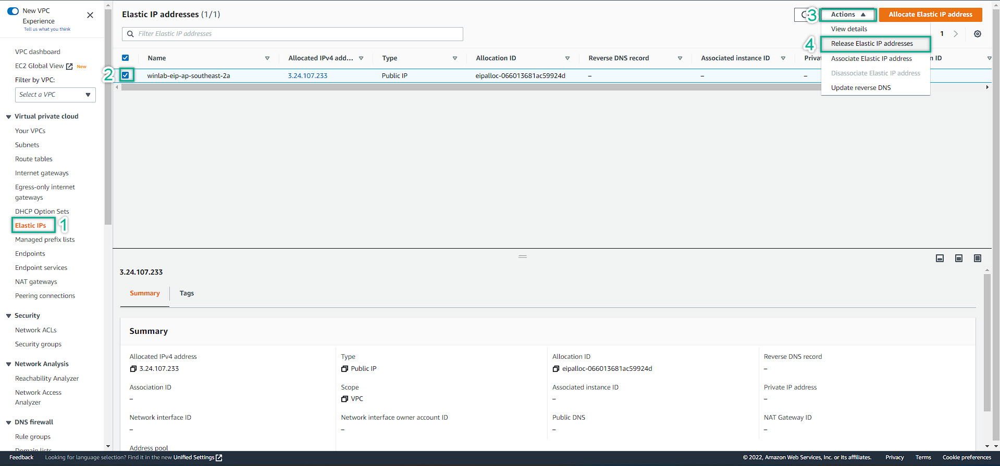

### Clean Up Services
---
To avoid unexpected charge from AWS. We are always remember to clean up what we have done after completed the lab.

---
1. Delete Amazon RDS
  
  

2. Terminate ALL EC2
  

3. Delete Directory Service
  

4. Delete NAT Gateway
  

5. Delete Internet Gateway: Detach the IGW from VPC => Delete IGW
  
  

6. Delete VPC

7. Delete Elastic IP

