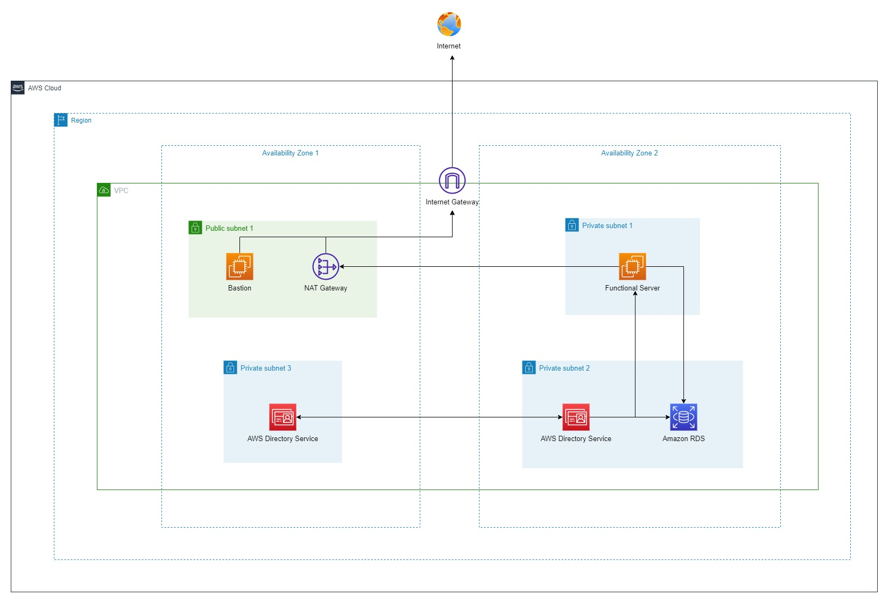

### Deploy and Manage Amazon RDS Service on Window Server
---
As a Network Administrator of a company, you are tasked to research and implement the Amazon RDS service. Your tasks are not only about how to deploy the Amazon RDS service, but also you need to find the way to manage the deployed RDS instances  

In this lab, we will go through step by step about how to deploy and manage Amazon RDS service. Then, you can write a report for your business point of view about the Amazon RDS function and what you can do after completed this lab. 

---

---
**Things to understand before doing this lab**

- [Creating Your AWS Account](https://000001.awsstudygroup.com/)
- [Setting up Budget for your Cloud Journey](https://000007.awsstudygroup.com/)
- [VPC - Virtual Private Cloud - Introducing and Getting to know](https://000003.awsstudygroup.com/)
- [EC2 - Introducing and Getting to know](https://000004.awsstudygroup.com/)
---
If you have not ready for the deep-dive into AWS Services - Windows On AWS. Please refer to this link for [Basic Windows On AWS](https://github.com/minhhung1706/Windows-On-AWS-Series/tree/main/Windows-On-AWS-Basic)

Once you have done all of those labs, i understand that you are ready to deep dive into the cloud. Let's get your hand dirty !

---

