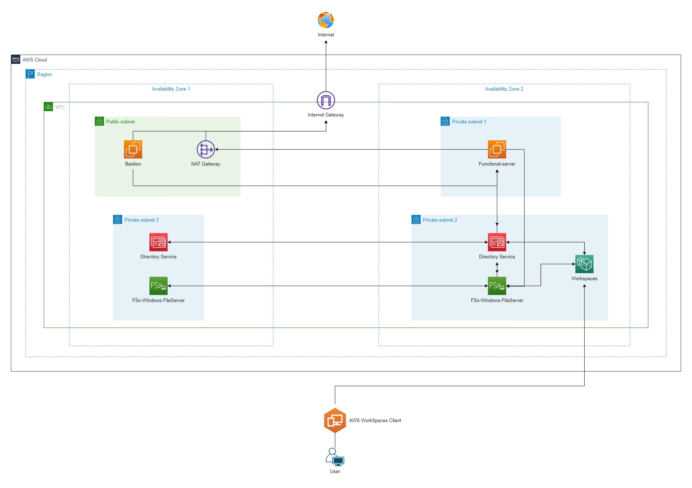

### Preperation
---
  

---
- 1 VPC
- 2 Public Subnet
- 2 Private Subnet
- 1 Internet Gateway
- 1 NAT Gateway
- 1 EC2: Bastion | Public Subnet | Public IP enable: YES
- 1 EC2: Functional Server: AD Manager and File Server (lab purpose only) | Private Subnet | Public IP enable: NO
- 1 ~ 2 WorkSpaces: Joined Domain
- WorkSpaces Client installed on your place