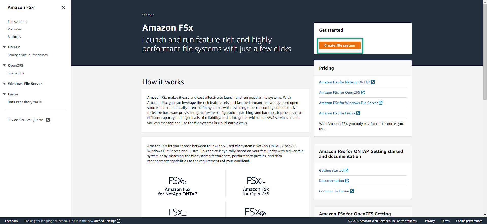
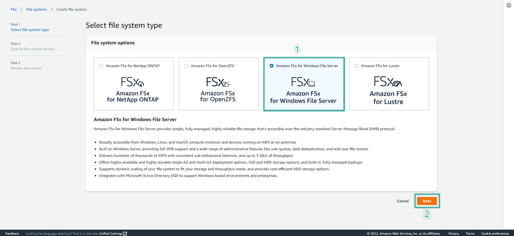
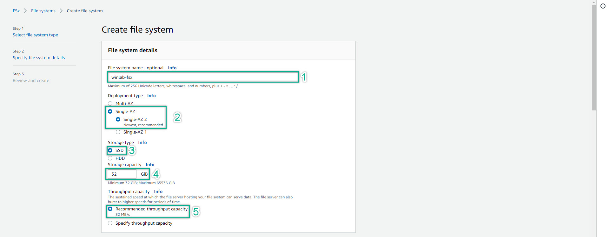
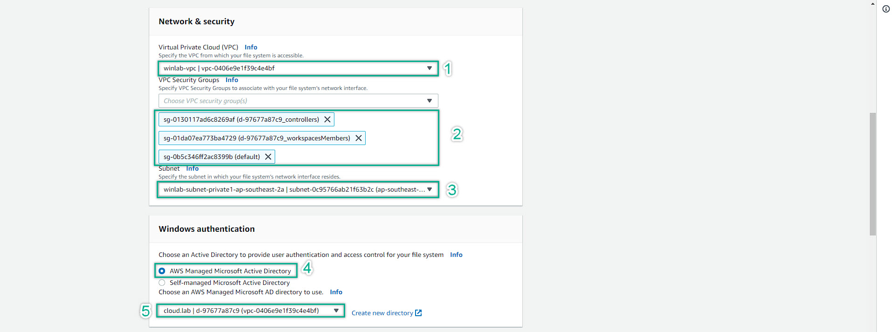
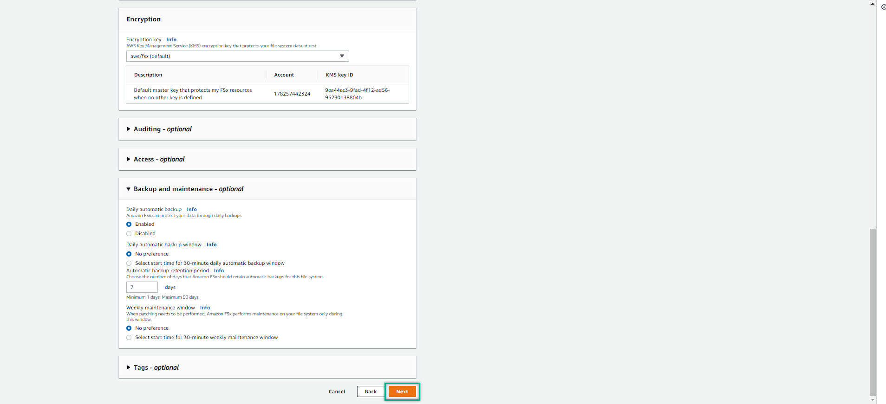

### FSx Deployment
---

1. Navigate to AWS Management Console and search for FSx. Then, let's get into the Amazon FSx management console. Click **create file system**
  

2. Then, choose FSx for Windows File Server => Next
  

3. Fill-in the option:
   - file system name
   - deployment type
   - storage type: SSD
   - Storage capacity: 32GB. For the lab purpose, just put the minumum available to save the cost of learning
   - Throughput capacity
  

4. Continue to configure as the figure bellow. Remember, you want to create the WorkSpaces first, then create the FSx later. The reason why, because of once you create the WorkSpaces, it will generate the security group.  

    Hence, if you create the FSx first, you are not going to be able to access and deploy FSx for your WorkSpaces. Still, some work-around solutions. However, in this lab, we will do the WordSpaces first so that we can understand the work-flow. In real-world scenario, we need to find the solution for ourselves because of there are so many issues as well as so many solutions. But if we understand the root cause issues and the based-solution, we will be able to solve some critical and tricky problems
  

5. Leave all of the next options as default. Except you want to give those options a try. Then, click NEXT
  

