### FSx As File Server
---

1. Connect into EC2 Functional Server  

2. Open the File Explorer => Copy and paste the FSx DNS => Bu default, there is a share folder insde the FSx. We can make another folder as wished incase of we have some of different departments / branches / offices    
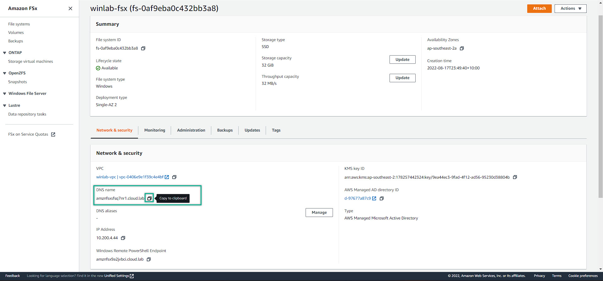
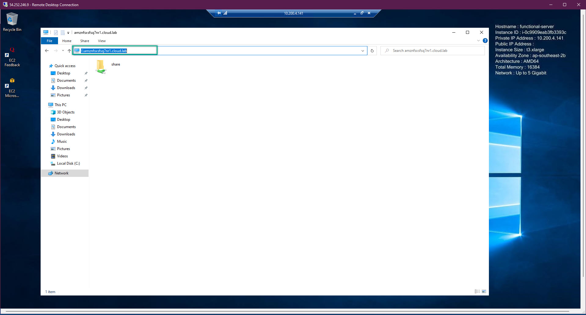    

3. Right click to the share folder => **Map Network Drive**
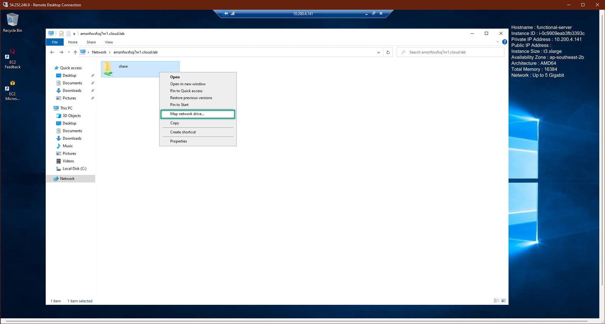  

4. Then click **Finished**
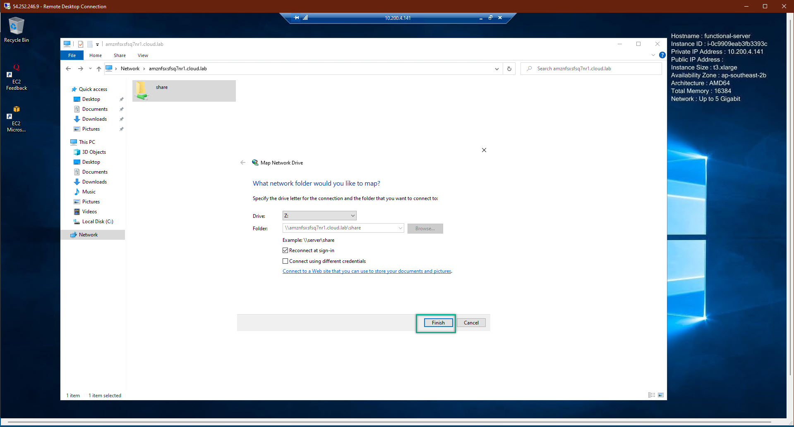  

5. Now, we will have the FSx at shared via the network
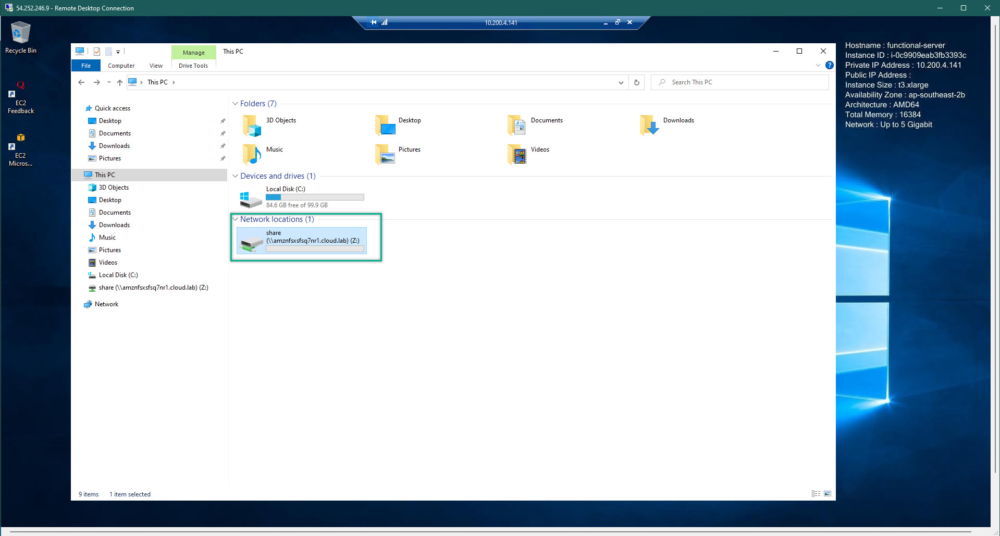  

6. Let's make 2 folder. Name as your desired. This is my 2 folders
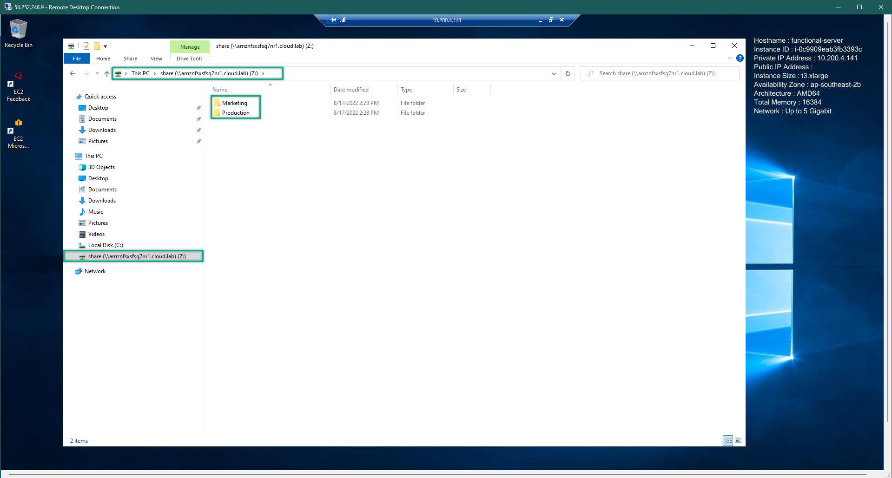  

7. Open the Active Directory User and Computer:
   - Create 2 Groups 
   - Add 2 users which are created when we deploy the WorkSpaces. Each user belong to a group
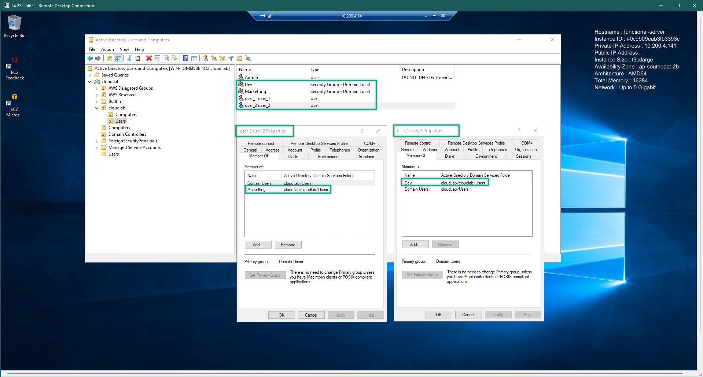  

8. Back to the FSx, right click to a folder and choose properties
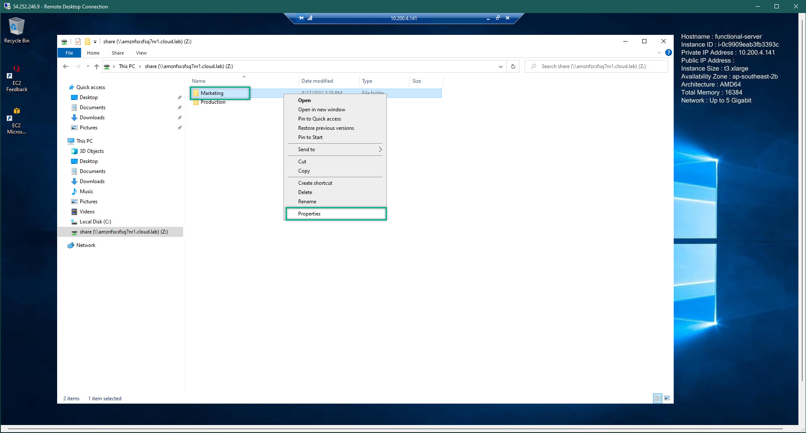  

9. Security tab => Advanced
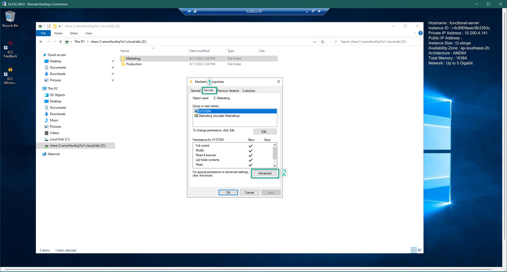  

10. There are some pre-configured. Click **Disable Inheritance** => will be a prompt box to warning => Just choose **Remove All Inheritance .....** ==> Click Add
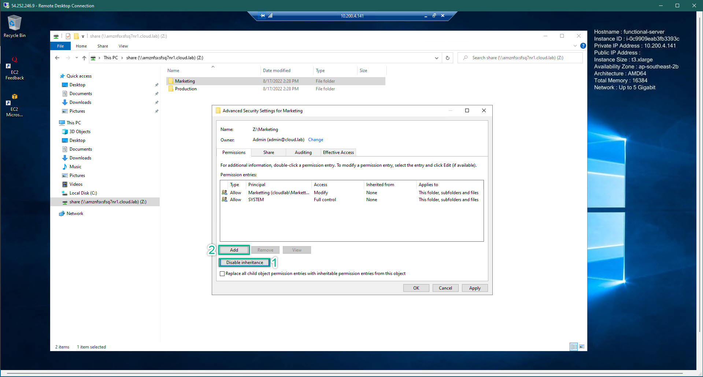  

11. Choose **Select Principle**
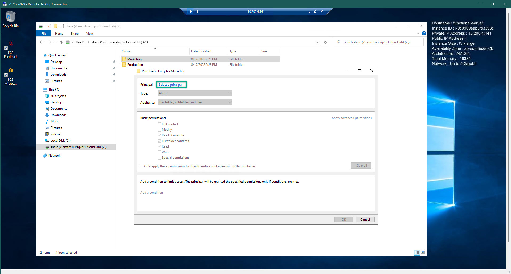  

12. We need to add the Group into this folder so that we can grand permission to the group. Hence, all of users who belong to this group will have access to a specific folder. Remember to add the SYSTEM to the folder too. Because of after we disabled inheritance, all of the users, groups, system will be deleted. 
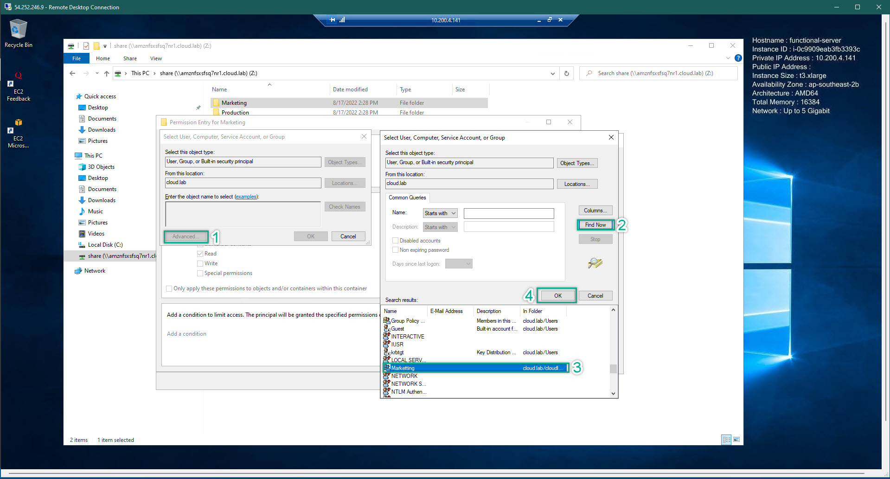  

13. After added a group. We need to grand some permissions. 
    - Group: All, **Except FULL CONTROLL**
    - SYSTEM: FULL CONTROLL
    - Admin: FULL CONTROLL: if u did not ad Admin, you (as Admin) cannot do anything
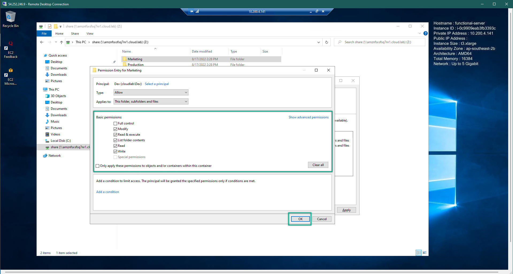  

14. After finished, we will have permission for a specific folder as followed. Do the same thing for all of the folder which created followed by the need's of organization. So that, we can grand the right permission for the right department
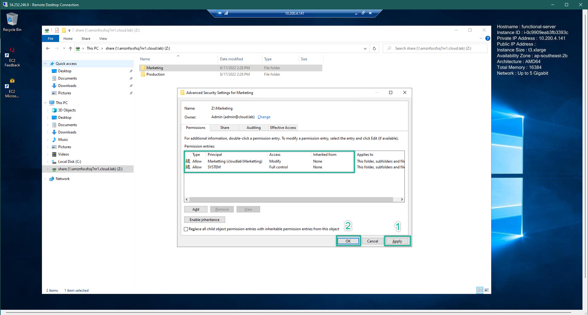  

