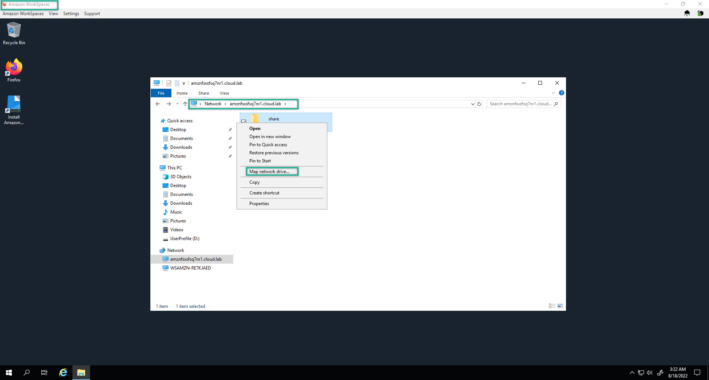
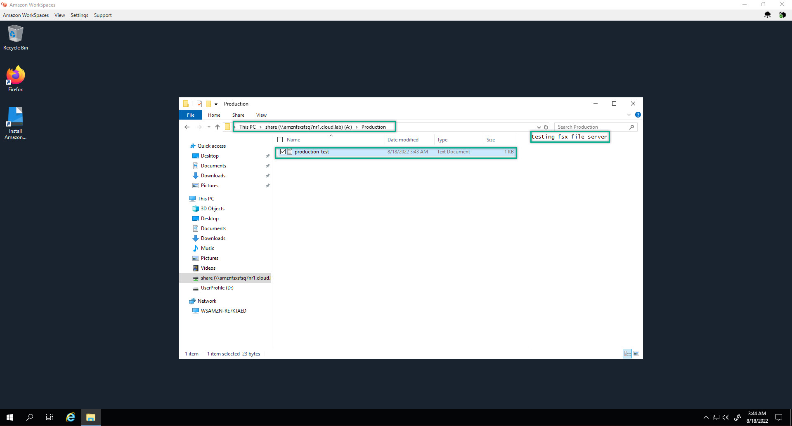
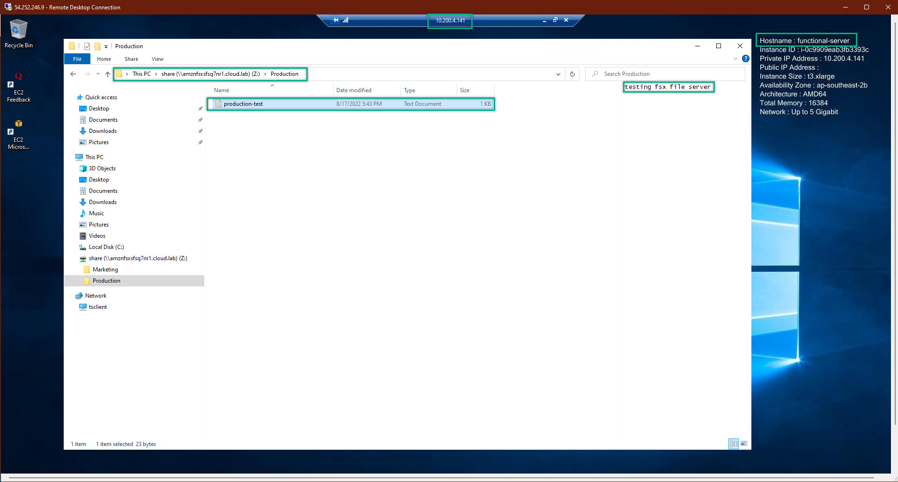
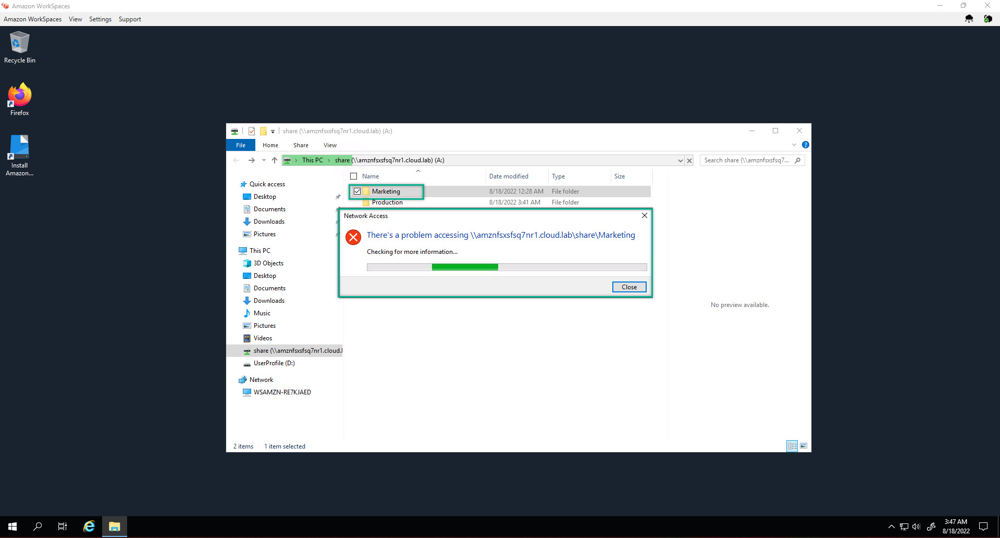

### Deploy FSx For Client - WorkSpaces
---
1. Log-in to WorkSpace

2. Copy the FSx DNS and paste to the WorkSpaces client => Map Network Drive
  

3. Then, create a test file with some text to see the file server replication
  

4. Back to the functional-server and open the fsx to check the data
  

5. As can be seen we have successfully grant permission for the right department. Logged-in as Dev, we cannot access to the folder of Marketting department
  

6. Do the samething for some of other folders. Then, we finished the FSx File Server  

7. Remmeber, understanding based-solution will help us to work and solve critical cases in the real-world

