### Clean Up Services
---
1. Terminate EC2
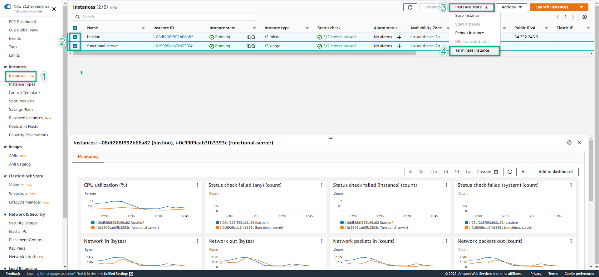  

2. Remove WorkSpaces
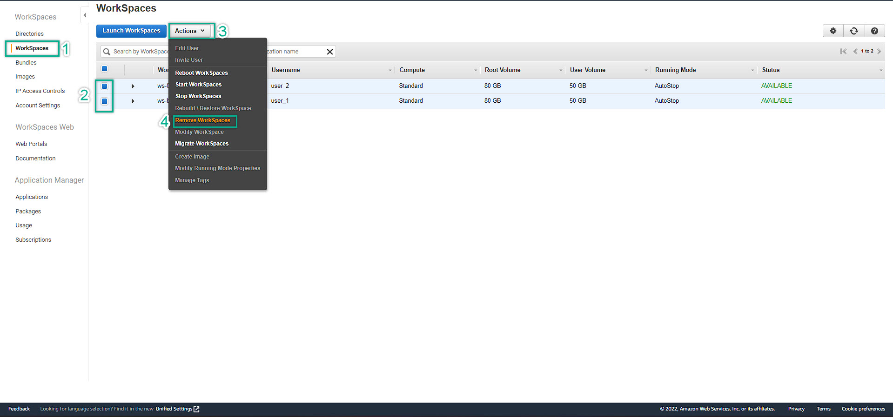  

3. Delete FSx
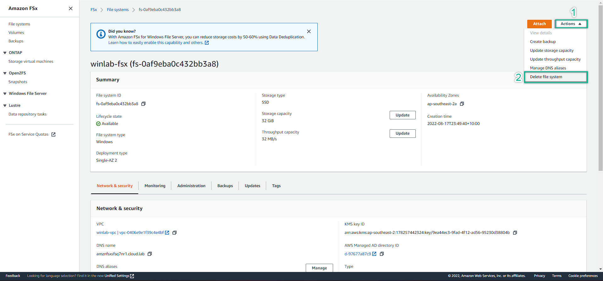  
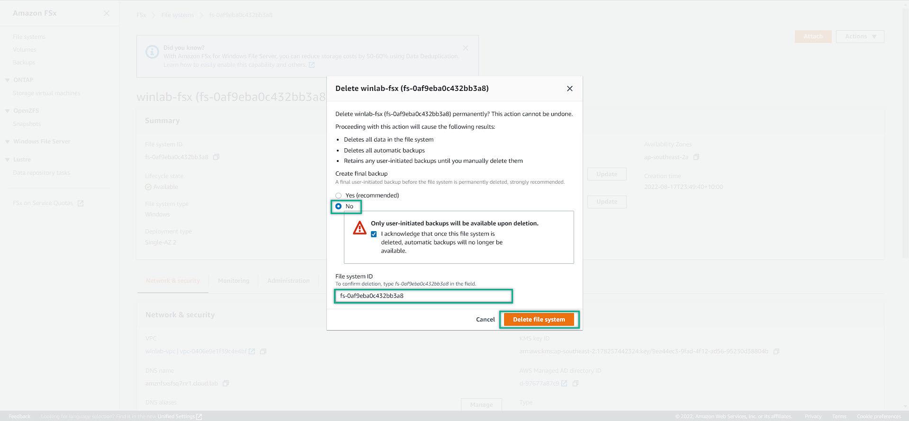  

4. Delete AWS Directory Service
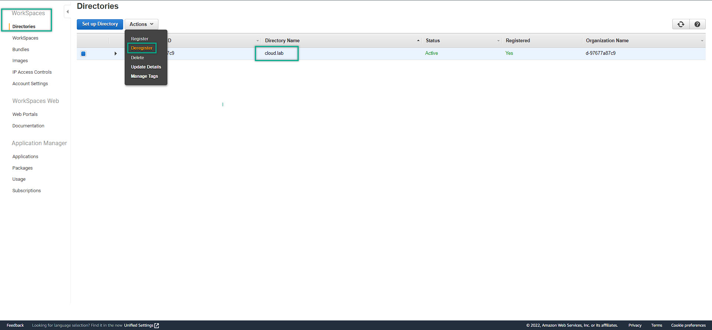  
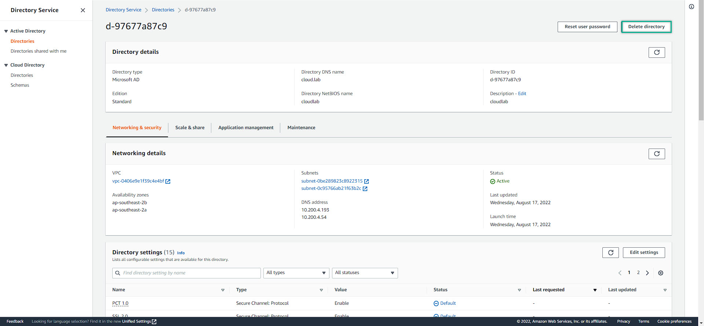  

5. Delete NAT Gateway
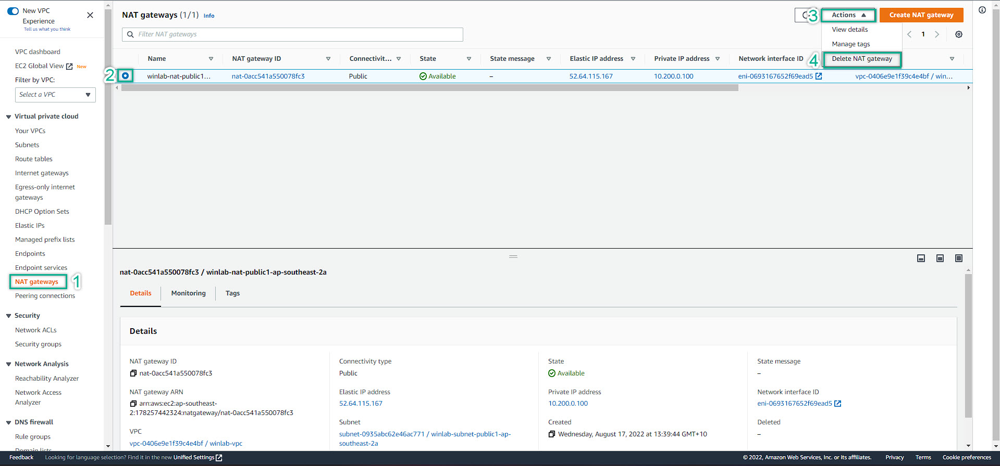  

6. Delete Internet Gateway
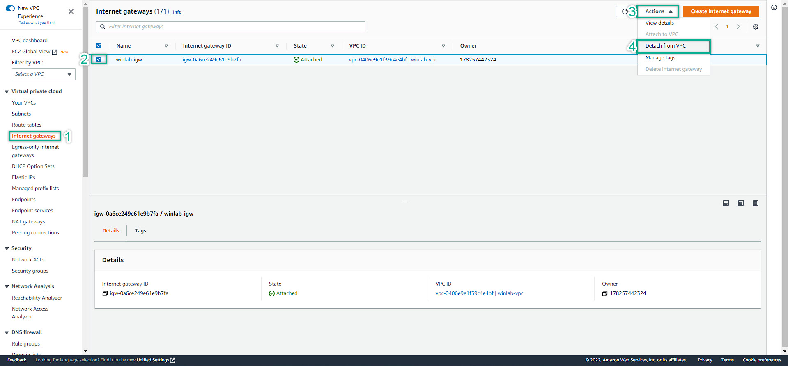  
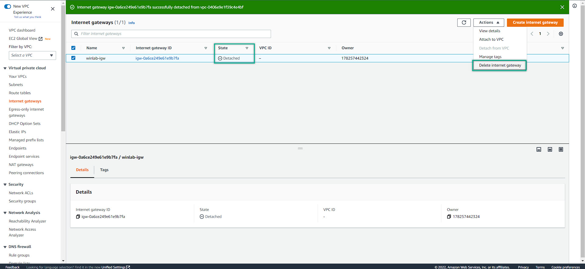  

7. Delete VPC
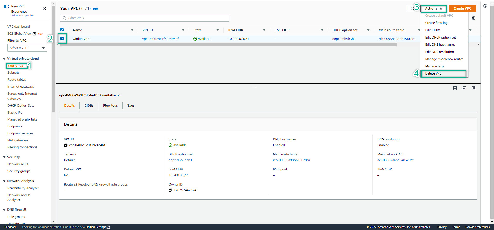  

8. Release Elastic IP

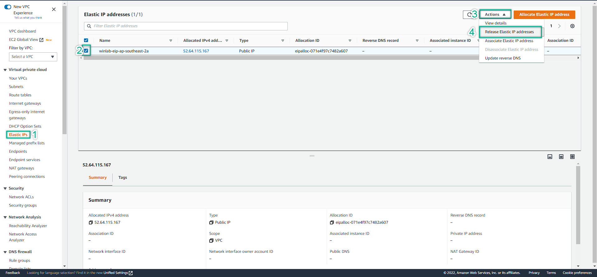  