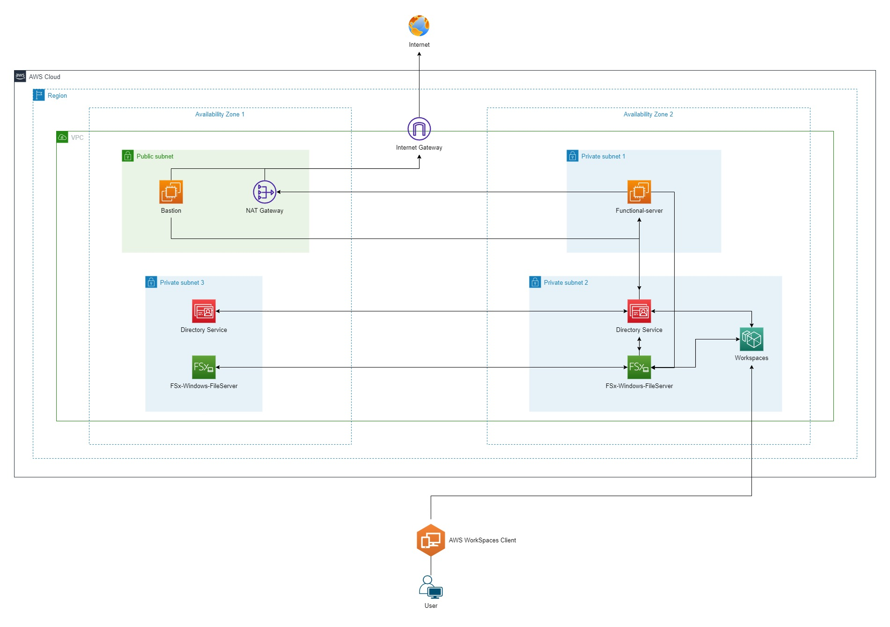

### Amazon FSx For Windows - File Server - WorkSpaces Storage
---
You are a Network Administrator of a company. Your company has an issue with file server and storage. Due to the demanding usage, your company decided to upgrade the current storage system. However, after did some researches, your presentation about the new file server has not been going through due to the cost cannot reduce as expected. 

Hence, by the time searching for another solution, you found out that Amazon FSx File Server for Windows will surely suitable for your business's needs. In this lab, we will going step by step about how to setup a storage system for you business by deploying and implementing Amazon FSx For Windows File Server

--- 

  

---
**Things to understand before doing this lab**

- [Creating Your AWS Account](https://000001.awsstudygroup.com/)
- [Setting up Budget for your Cloud Journey](https://000007.awsstudygroup.com/)
- [VPC - Virtual Private Cloud - Introducing and Getting to know](https://000003.awsstudygroup.com/)
- [EC2 - Introducing and Getting to know](https://000004.awsstudygroup.com/)
---
If you have not ready for the deep-dive into AWS Services - Windows On AWS. Please refer to this link for [Basic Windows On AWS](https://github.com/minhhung1706/Windows-On-AWS-Series/tree/main/Windows-On-AWS-Basic)

Once you have done all of those labs, i understand that you are ready to deep dive into the cloud. Let's get your hand dirty !

---

