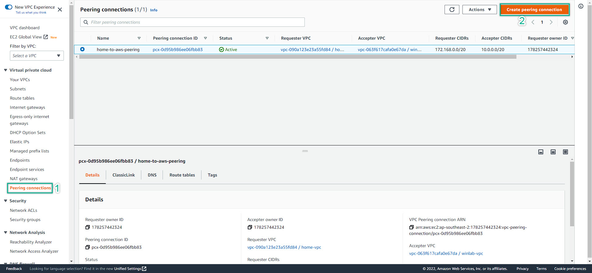
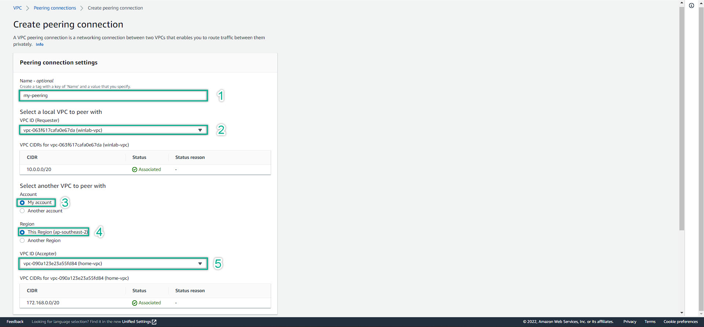
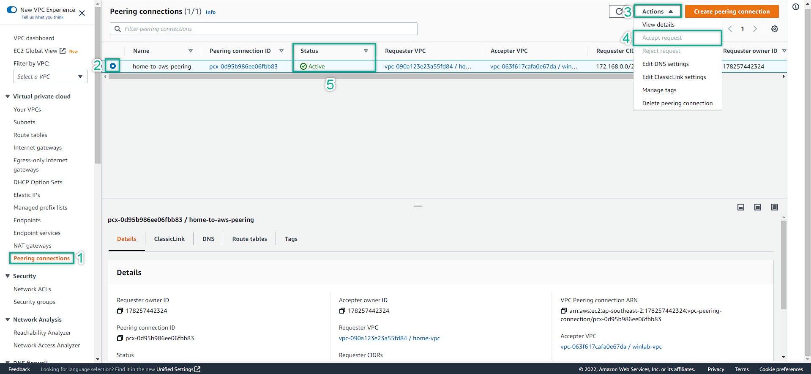

### VPC Peering Configuration
---
We need to do this first before doing anything else. Especially configure the Security Group. The reason why because if we did not configure the VPC Peering, when we perform to link the Security Group, AWS will show error as **"The Security Group is in a different Network, cannot communicate"** , something like that.  
Hence, we need to make sure that our VPC will have the connection flow before doing anything else.

---
1. Navigate to VPC Management Console
   
2. Fill-in the peering information:  
   - Peering Name  
   - VPC ID: Requester  
   - Select Account  
   - Select Region  
   - VPC ID: Accepter
   - Scroll down to the end: click **Create Peering Connection**  
  
3. Then, **Accept Request** and check the Status of the peering connection  
  
   
