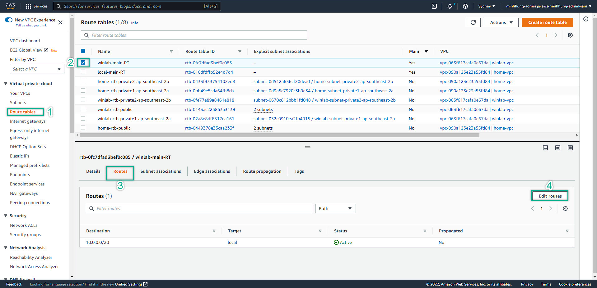

### Configure The Routing Table
---

We finished setup the VPC Peering. However, it does not mean our services inside a VPC can communicate to the others VPC. Hence, We need to configure the Routing Table so that to route the traffic from source to destination

---
1. Navigate to VPC Management Console => Route Table
