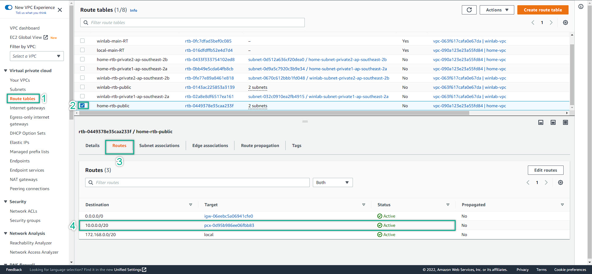

### Configure The Routing Table
---

We finished setup the VPC Peering. However, it does not mean our services inside a VPC can communicate to the others VPC. Hence, We need to configure the Routing Table so that to route the traffic from source to destination. Remember to name our Route Table to coresponse with what it does so that we can understand which RT doing which task  

=> Save the IP Address Range of 2 VPC, in my case:  
- AWS Site: 10.0.0.0/20
- Local Site: 172.168.0.0/20

---
1. Navigate to VPC Management Console => Route Table
    
2. Add the peering connection to the route table
  
  
3. We route the traffic for:
   - AWS Site: Main Route and Public Route (Public route is the one with Internet Gateway attached)  
   - Local Site: Main Route and Public Route  
   - Remember to double check the routes
  
  
