### EC2 Configuration 
---

We are now going to configure EC2 on both **AWS Site** and **Local Site**

---

**I. AWS Site**  
If you were not ready, then back to the basic guide before doing this lab. I assumed you have already leveled up your skills:  

In this site, what we need to do are:  
- Edit Computer Name
- Edit the IP Address
- Edit hosts file
- Install the neccessary Administrator Tools (basic guide)
- Test the communication between EC2 Bastion and EC2 AD-Manager  

  
  
  

---

**II. Local Site**  
We need to upgrade the EC2 in the private network to Domain Controller   

1. Open Server Mamanger to perform the tasks  
  
  
  
  
 
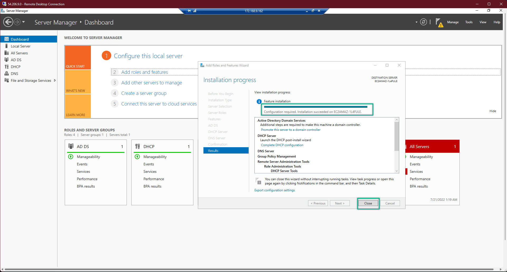  
  
2. Promote the server to become a Domain Controller  
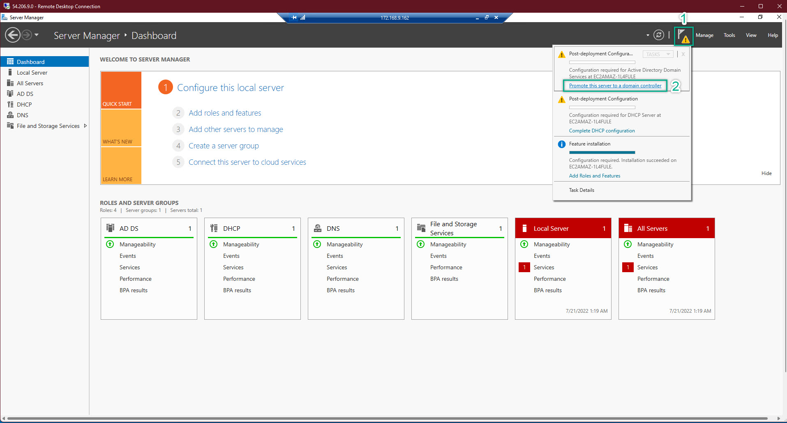  
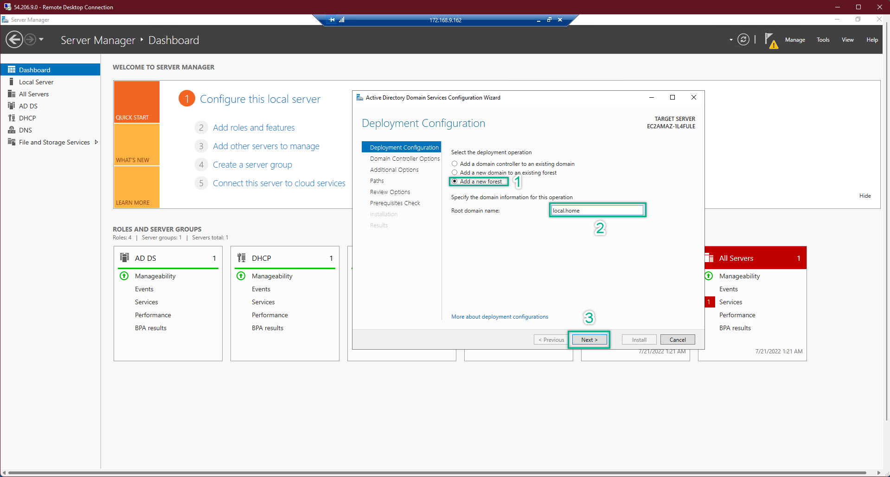  
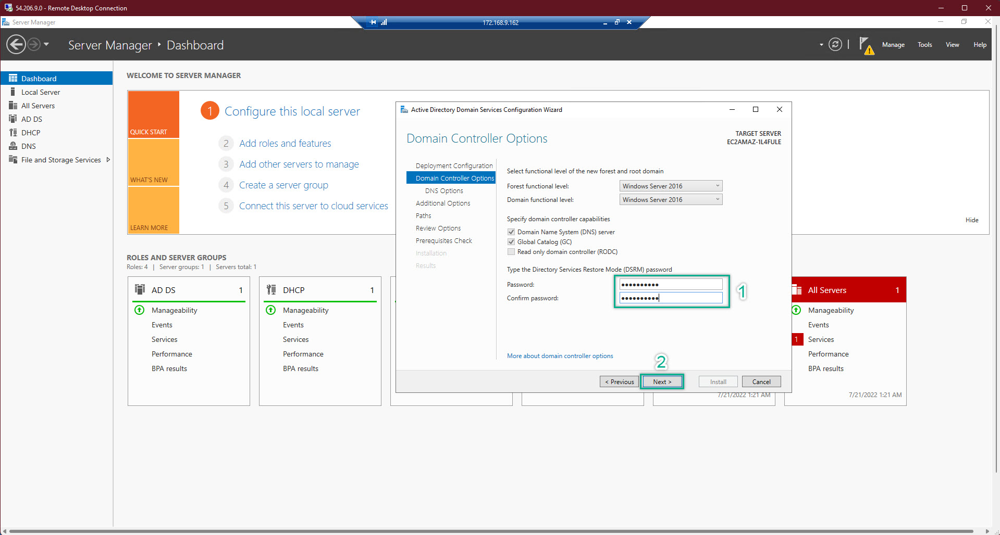  
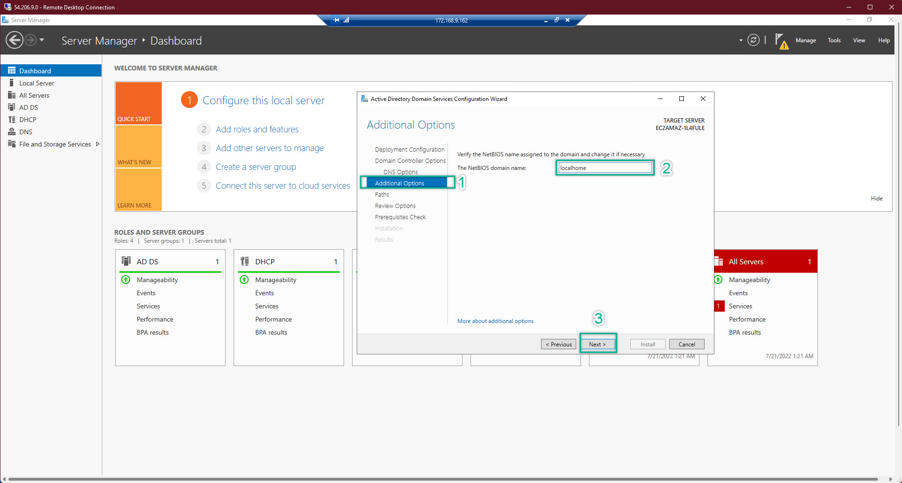  
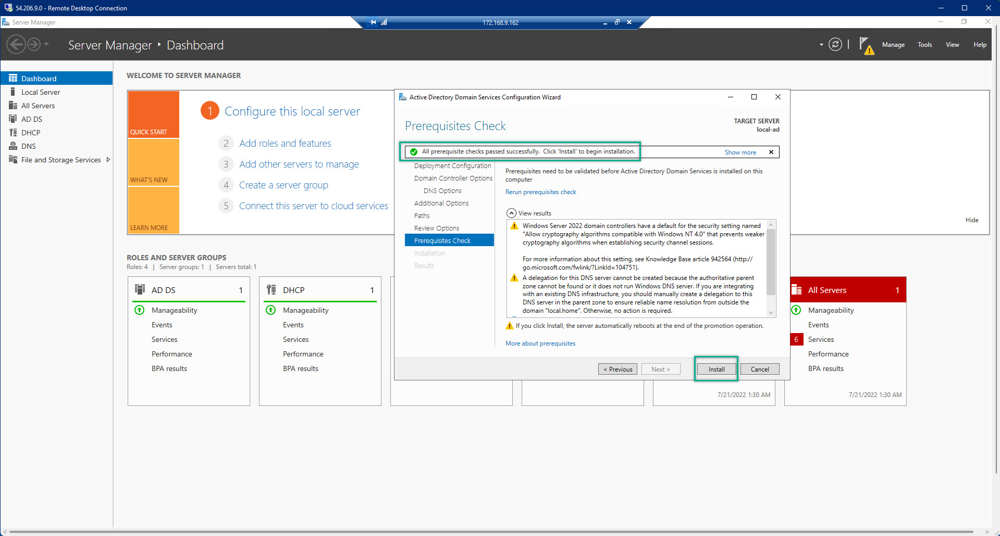  

3. After the installation finished, the server will restart. Then, login again to check the server has become a Domain Controller  
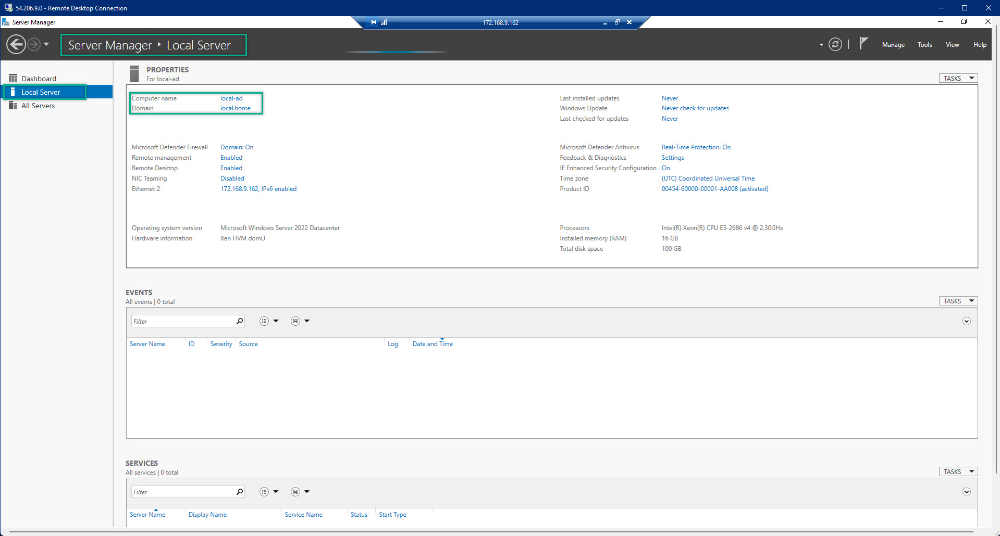  

4. Double check the IP Address of the Domain Controller. After restart, the DNS will be flushed and added a loopback address. Then re-configure it again  
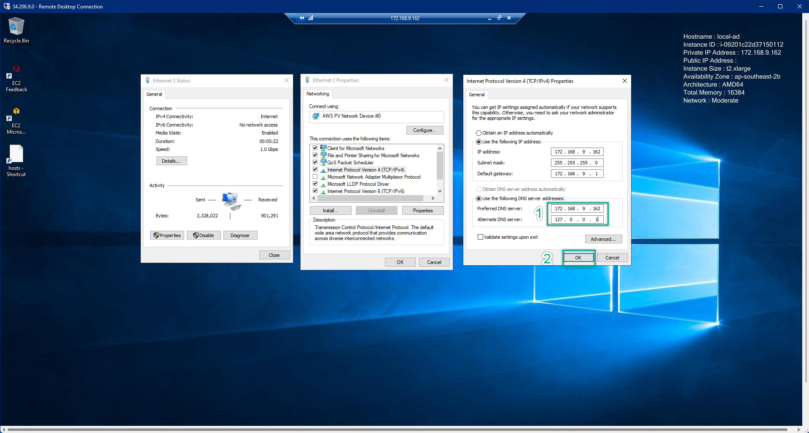  

5. Checking the Servers communication
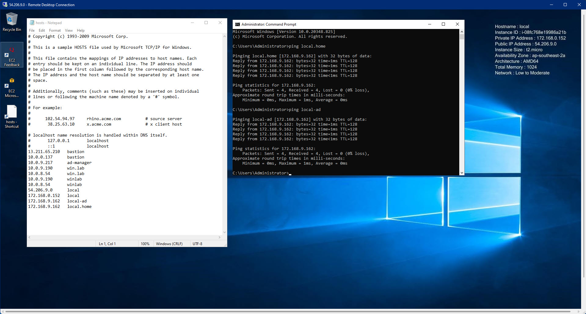  
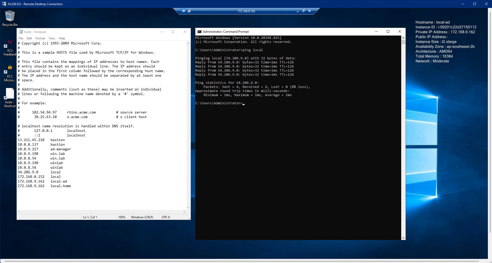  

---

**III. Testing Server Communication on both sites**
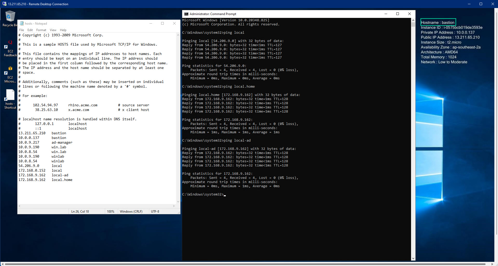  
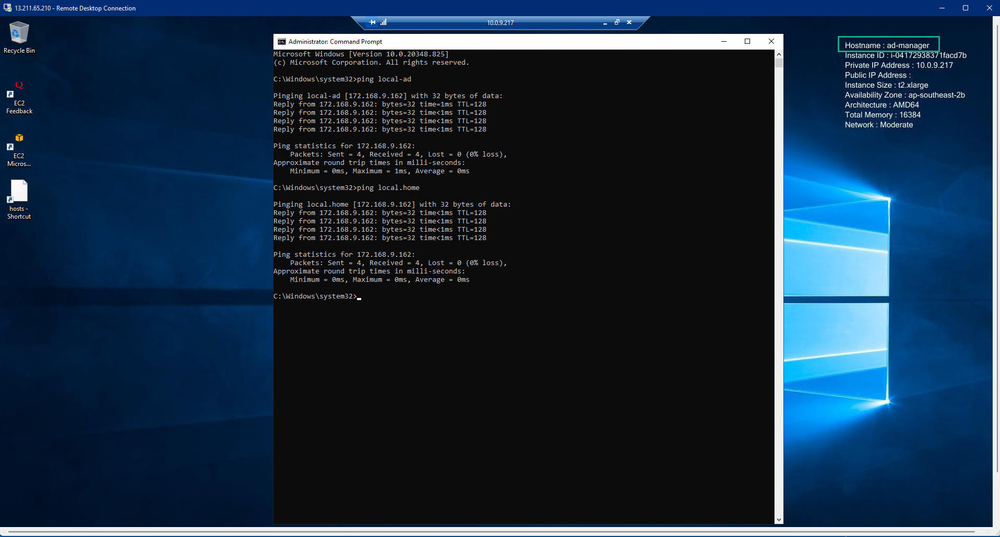  
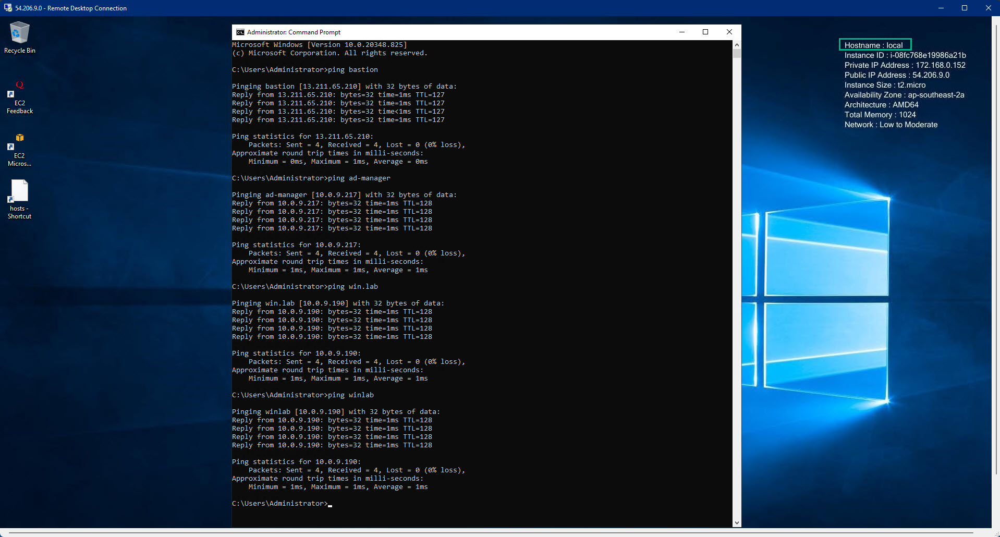  
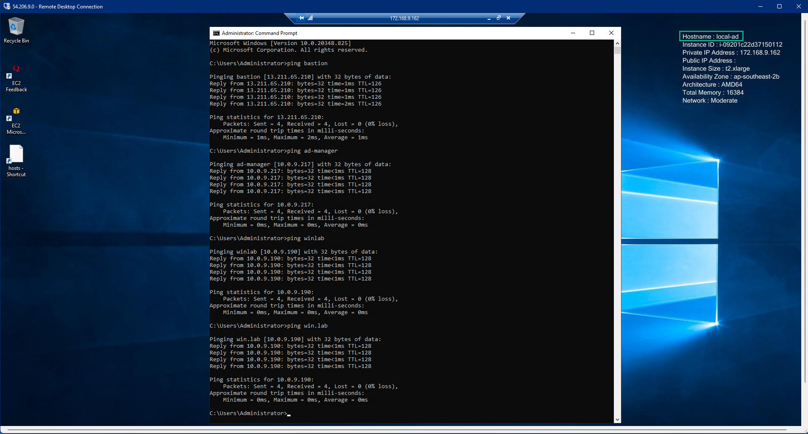  

 

 

