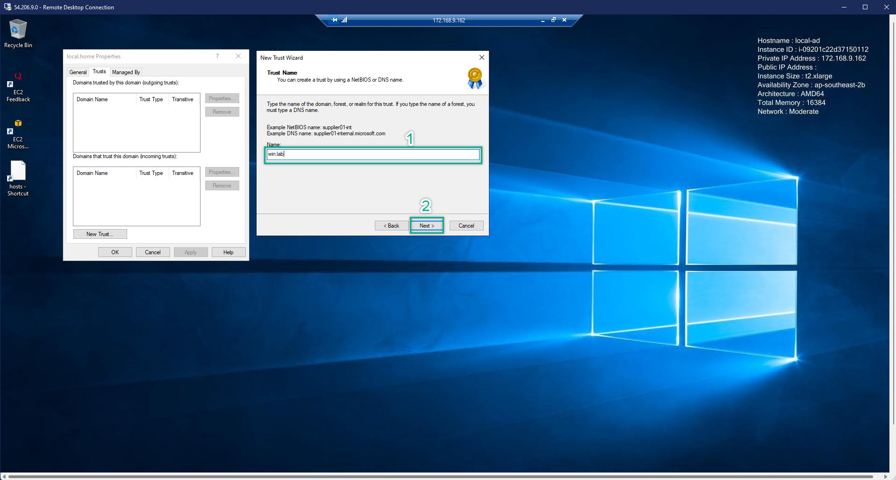

### Verifying Local Domain On AWS Managed Directory Service
---

After we have done everything about setup the environment. Now, we will start some more steps to verify our domain on AWS Managed Directory Service.

---
1. At the Local Domain Controller, open the DNS tool
  

2. On the DNS Manager, open the domain => Conditional Forwarders => Right Click => New Conditional Forwarders  
   

3. Add the FQDN (Fully Qualified Domain Name) and its IP Addresses of the AWS Managed Directory Service that we created before. For now, just ignore the red mark    
  

4. Open the Server Manager
  

5. On the Active Directory Domain and Trust => Right Click to the local domain => Properties  
  

6. We will add trust **FROM** our **Local Domain TO AWS Managed Directory Service**  
  
  
  
  
  
  
  
  
  
  
  
  
  

7. Comeback to the DNS Management => Check the status of Conditional Forwarders again
  
 
  

8. Go to the AWS Managed Directory Service => Choose the **created** Active Directory => Directories menu => Scroll DOWN => Trust Relationship => Action => Add Trust Relationship
  
  
=> Add the IP Address of the Local Domain Controller
  

9. After waiting for a while, we will see the out-come result
  
=> This is expected Error and bellow something need to be check to make sure that we can connect/verify both local-domain and AWS Directory Service. 
   - Checking again ALL Security Group. Make sure that EACH Security Group have both Inbound and Outbond with => All Traffic | 0.0.0.0/0
   - Each Security Group MUST have added IP range is added for both Inbound and Outbound of the other VPC
   - Each Security Group MUST have added ALL the others SGs to both Inbound and Outbound
   - Checking your Instance Type. Your recommended instance type should be at least t3.small The reason why because of each instance family will have a limit speed of Network Performance, this is also mentioned by AWS when you choose an instance. Hence, The better instance type (ex: t3.xlarge | Up to 5G Network Performance), the easier you do the local-domain verification. The Verification process can be simply understood as: 2 domain will start to communicate each other. Hence, if the local-instance with low network performance, can lead to failed-verification.  

10. Verification Success
  

