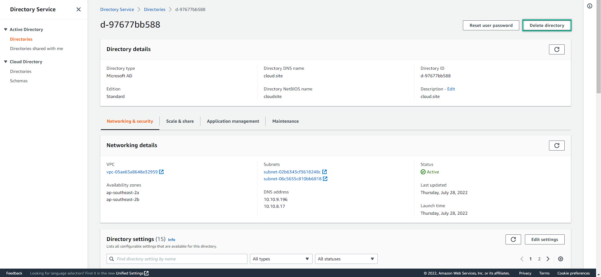
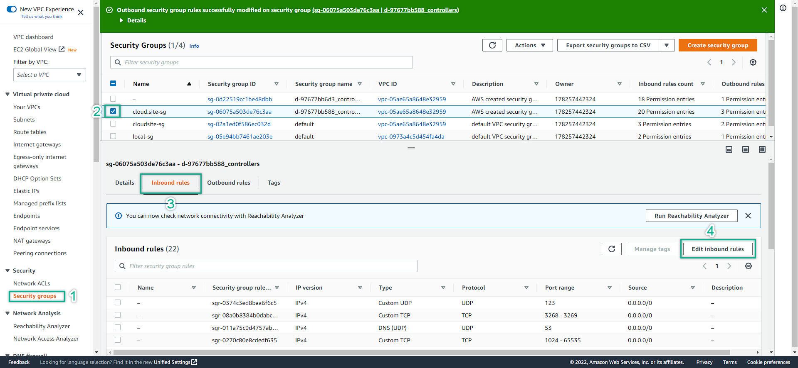

In this section, we will start to clean up all of the services to avoid unexpected charge from AWS  

---
1. Terminate all EC2  
  
  

2. Delete AWS Directory Service   
  
  

3. Delete ALl Security Group Rules: do for both inbound and outbound
  
  
  

4. Delete Peering Connection
  
  

5. Delete NAT Gateway
   Due to the purpose of the lab, we had 2 VPCs; hence, we had 2 NAT Gateway. Just delete all of them
  

6. Delete Internet Gateway
   Due to the lab purpose, we had 2 IGW. Just delete both of them
  
  
  

7. Delete VPC
   Due to the lab purpose, we had 2 VPCs. Just delete both of them  
  
  

8. Delete Elastic IP:  
   If you left the un-used Elastic IP. You would be charged for the IP service
  
