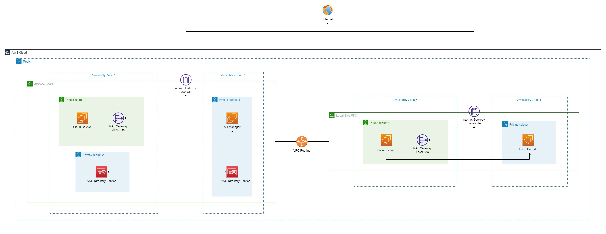

### Verifying Local Domain With AWS Managed Direcroty Service
---
You are a System and Network Engineering of an enterprise business. Due to the demanding of morden-working, your CIO grands you a task which is to understanding about how to use the built-in active directory domain controller on AWS.  

You have some understanding about how AWS works. Hence, you are starting to build your own lab about how to make both of AWS Managed Directory Service and the local domain to be able to work together.

This lab will assist you at most understanding with both of the infrastructure and hands-on  

---

---

**Things to understand before doing this lab**

- [Creating Your AWS Account](https://000001.awsstudygroup.com/)
- [Setting up Budget for your Cloud Journey](https://000007.awsstudygroup.com/)
- [VPC - Virtual Private Cloud - Introducing and Getting to know](https://000003.awsstudygroup.com/)
- [EC2 - Introducing and Getting to know](https://000004.awsstudygroup.com/)
---
If you have not ready for the deep-dive into AWS Services - Windows On AWS. Please refer to this link for [Basic Windows On AWS](https://github.com/minhhung1706/Windows-On-AWS-Series/tree/main/Windows-On-AWS-Basic)

Once you have done all of those labs, i understand that you are ready to deep dive into the cloud. Let's get your hand dirty !
