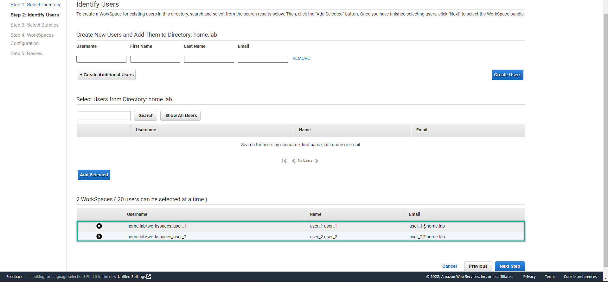

### Deploy Amazon WorkSpaces
---
1. Left side menu => Workspaces 
    
2. Do follow the step-by-step from Amazon WorkSpaces Management Console
 
3. Create users directly from WorkSpaces Management Console
  
  
4. After created user from WorkSpaces Management Console, we come to the AD-Manager EC2 to active the user account, do for all of the accounts:  
   - Reset the user password: right click to the choosen user => Reset Password
   - Enable the user account  
  
  
  
  
5. Create user account from Active Directory Users and Computers  
   - Right click to the users => new => user
   - Full fill all required information, included password
   - Un-checked the **User must change password at next log-on**
   - Check password never expires
   - Finished
    
  
  
  
6. **Things to remember:**   
   - user account which **created from WorkSpaces Management Console** need to do Password Reset, then Enable the user account  
   - user account which **created from the Active Directory Users and Computers** DO NOT NEED to do Password Reset and Enable account  
   - For those users which are created from the AD-Manager, you need to add email for the users so that can add them to the WorkSpaces environtment. If not, WorkSpaces will prompt error **"User need to have an email address ...."**  
7. Show all of users we had and add them to the WorkSpaces environment, then click Next
   
   
8.  To pay attention that Amazon WorkSpaces are currently provides 2 differences protocols:  
   - **PCoIP:** if you want to use Amazon WorkSpaces on tablets (iPad / Android)  
   - **WSP - WorkSpace Streaming Protocol:** for higher loss/latancy tolerance  
   - For more information about Amazon WorkSpaces protocol, please refer to this link: [Amazon WorkSpaces Protocol](https://docs.aws.amazon.com/workspaces/latest/adminguide/amazon-workspaces-protocols.html)
  
9. There are so many choices, but let choose the Standard Windows 10 with Office to experience the most basic needs for an office employee: Windows and Office Suite
  
10. We can also deploy Auto Stop the WorkSpaces to save the cost. Let's say, a normal office employee working 8hrs/day. Then, we will set the time for it.      
    - **After done setting up the time => Scroll DOWN => NEXT**
  
1.  After review our setup, click **Launch WorkSpaces**. It takes 20 minutes for workspaces to be availabled
    
   

 