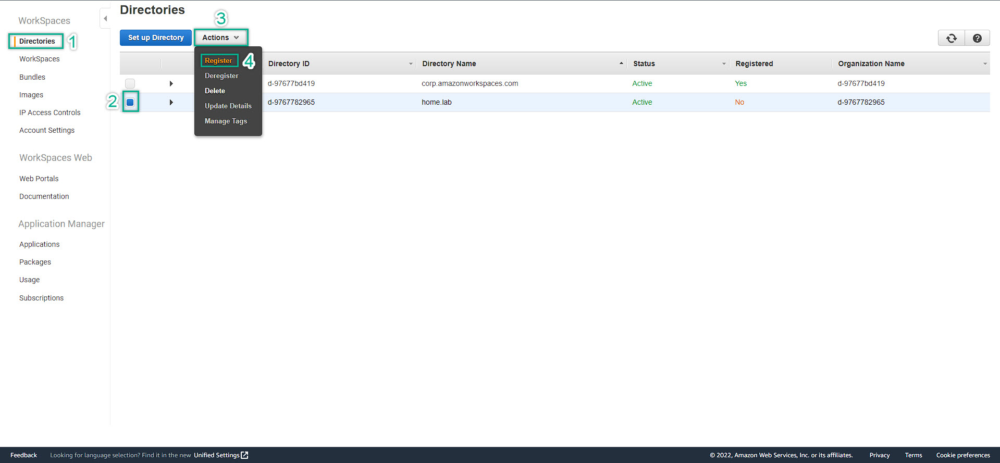
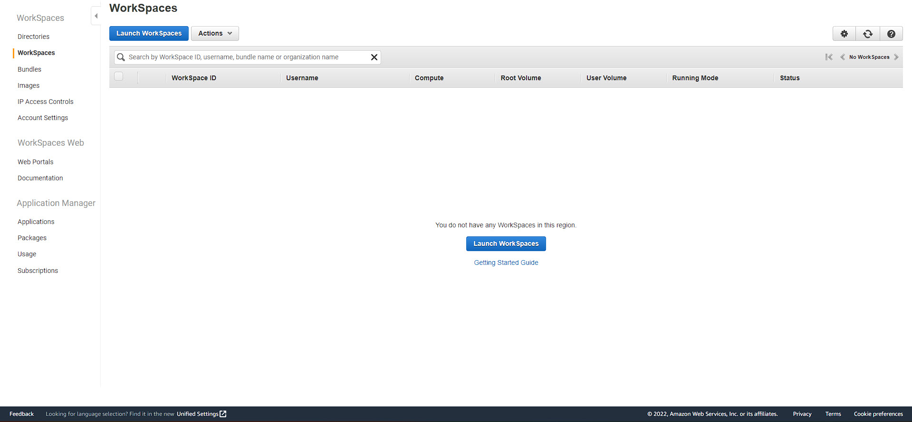
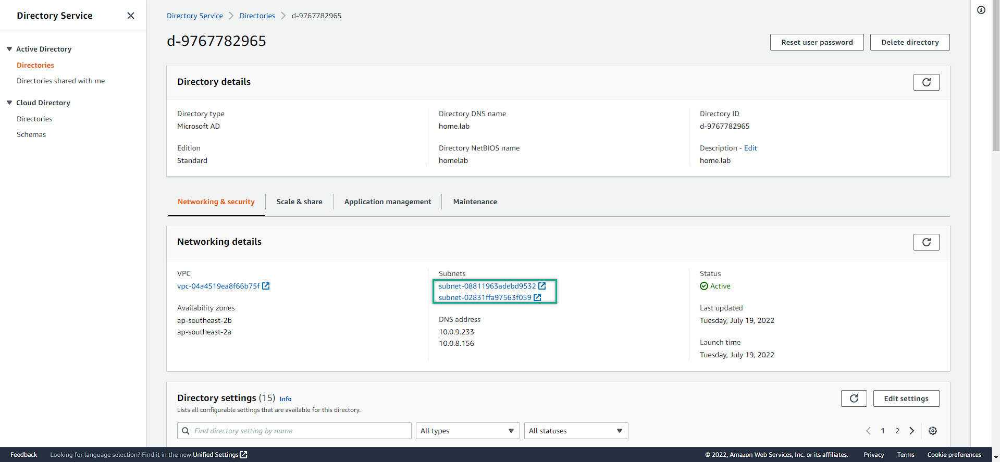

### Deploy Amazon Workspaces
---
1. At the AWS Management Console, search for Workspaces
  
2. This is the Amazon Workspaces Management Console
  
3. Click the Getting start now
     
4. Quick Setup => Launch
  
5. To pay attention that Amazon WorkSpaces are currently provides 2 differences protocols:
   - **PCoIP:** if you want to use Amazon WorkSpaces on tablets (iPad / Android)
   - **WSP - WorkSpace Streaming Protocol:** for higher loss/latancy tolarance 
For more information about Amazon WorkSpaces protocol, please refer to this link: [Amazon WorkSpaces Protocol](https://docs.aws.amazon.com/workspaces/latest/adminguide/amazon-workspaces-protocols.html)
  
6. Then, we create 2 users for testing purpose. Filling the information as the figure bellow
  
7. Waiting for a while, probadly 20 minutes for workspaces to be completely available. Then Click the **View WorkSpaces Console**
  