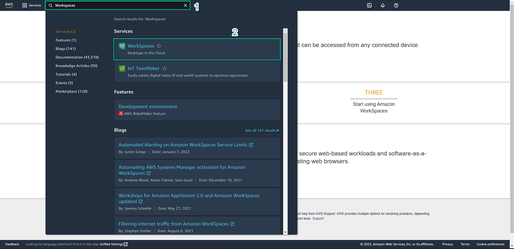
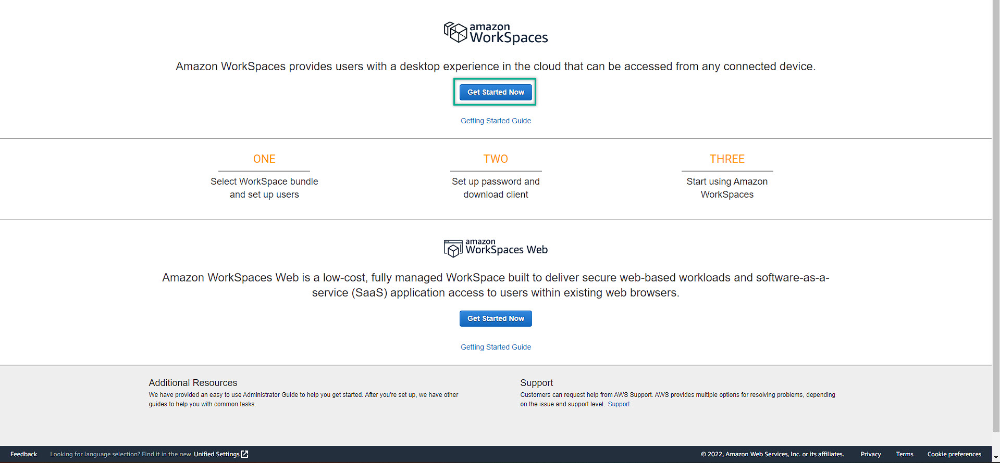
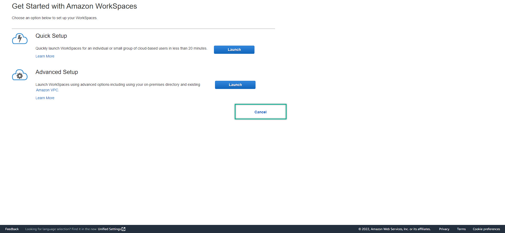

### Prepare To Deploy Amazon WorkSpaces
---
1. At the AWS Management Console, search for Workspaces
  
2. This is the Amazon Workspaces Management Console
  
3. Click the Getting start now
     
4. Click Cancel, you might jump to the Amazon Workspaces Management Console
  
 
5. Get back to the AWS Directory Service Management Console, then choose the created directory, note down the subnet id
  
6. Then, go to the Amazon WorkSpaces Management Console => Choose the Directory menu on the left side. 
   - Choose the prepared Directory 
   - Action
   - Register
  
  
7. Wait for the Registered turn into YES
  
    
