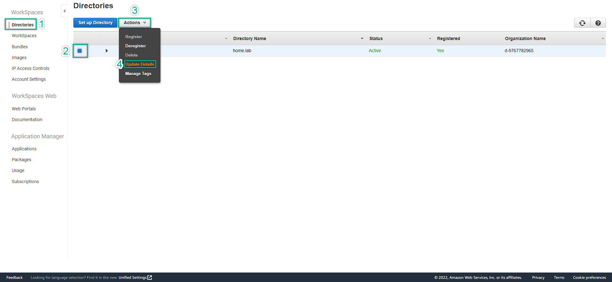
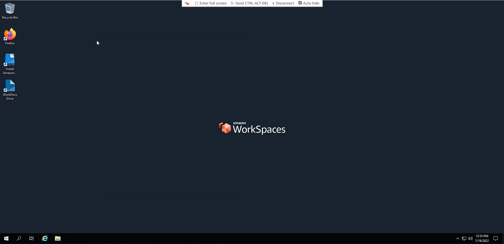
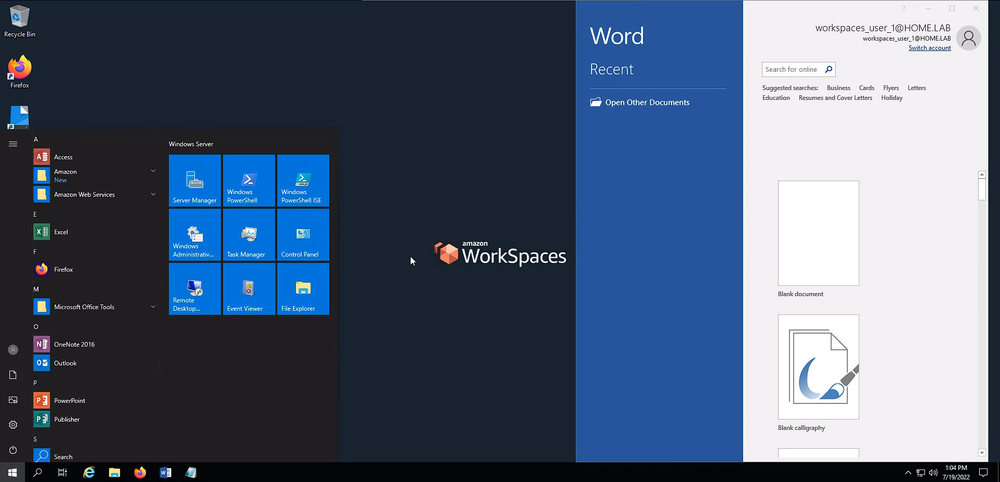

### Access To Amazon WorkSpaces Via Browser
---

1. Copy and paste the provided link to the browser. Then, save the **"Registration Code"**
  
2. Choose the Web Access => Recommended to open in Private Browser mode
   
3. This is the expected error
  
4. We will need to update the Directory to fix this => Access Control Options => Check Web Access => Scroll Down => Update and Exit

  
5. Then, we try again and we will see the error is fixed. Enter user name and password
  
6. This is the Amazon WorkSpaces
     
7. Internet Access on WorkSpaces
  
8. File Explorer on WorkSpaces

9. Fully working Microsoft Office Suite
