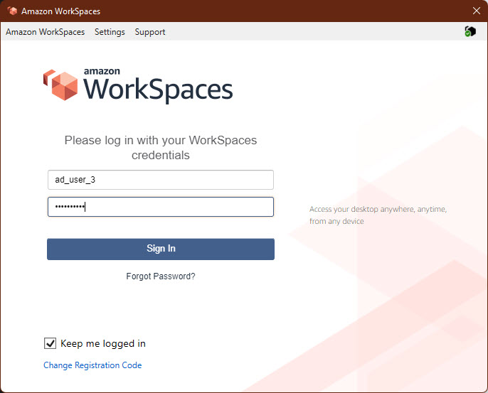

### Access To Amazon WorkSpaces Via Amazon WorkSpaces Client
---

1. Download the client to the local computer and then install it
  
2. This is the Amazon WorkSpaces Client UI (User Interface)
  
3. We will try to log-on with the user that created directly from Active Directory Users and Computers
  
4. As can be seen, Licenced Microsoft Excel with full of function and templates such as: invoice, charts, schedule and more than enough to use.
  
