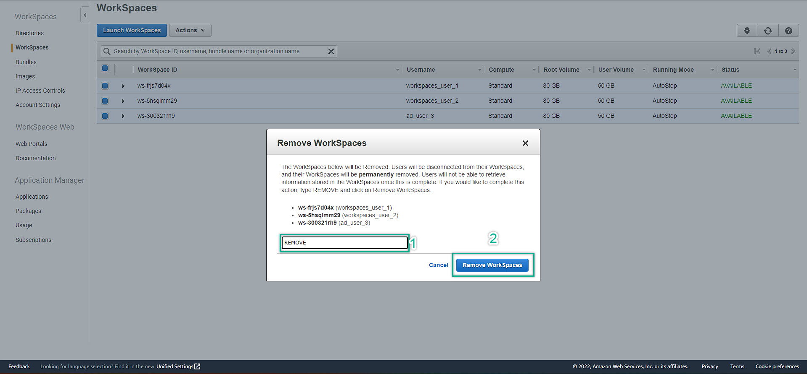
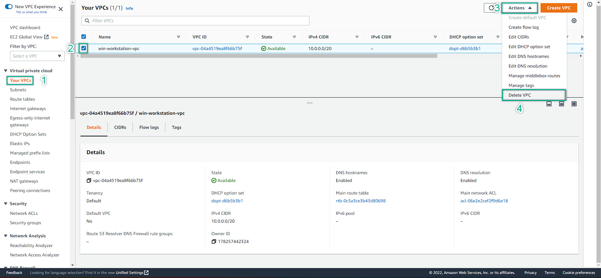

### Clean Up Services
---
1. Remove WorkSpaces
   - Navigate to WorkSpaces Management Console
   - Choose WorkSpaces menu on the left
   - Choose All available WorkSpaces
   - Action => Remove WorkSpaces => confirm to remove
   - Pay attention to the WorkSpaces Status => **TERMINATING** 
   - After 5 minutes, refresh browser and click the reload button to make sure that all of the WorkSpaces have been deleted
  
  
  
  
2. Deregister Directory
 
  
    
3. Delete AWS Managed Directory Service
  
  
  
  
4. Delete EC2
  
  
   
5. Remove the relationship-rule of Security Group: 
   - Delete ALL the rule => save
   - Do for ALL the available security group
  
    
6. Delete NAT Gateway
  
  
  
7. Delete Internet Gateway
  
  
  
  
   
8. Delete VPC
  
  
9. Release Elastic IP: If you left the Elastic IP unused, you will be charged  
  
  
---
 

