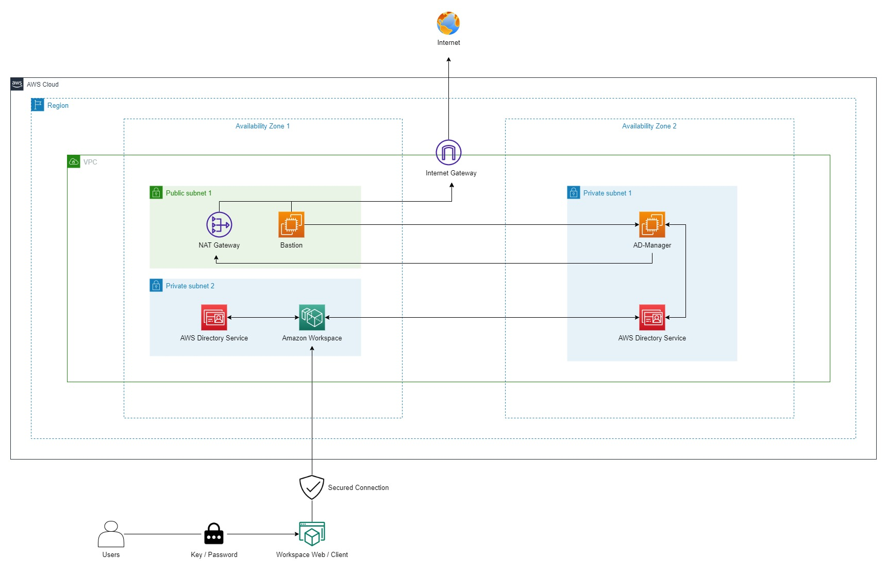

### AWS Workspace
To adapt the modern-working, you, as a System Administrator of a company has been tasked to research and to experience the state-of-the-art of the cloud technology - AWS Workspace.

In this lab, we will examine and experience AWS Workspace environment

---
Getting to know with AWS:
- [Creating Your AWS Account](https://000001.awsstudygroup.com/)
- [Setting up Budget for your Cloud Journey](https://000007.awsstudygroup.com/)
- [VPC - Virtual Private Cloud - Introducing and Getting to know](https://000003.awsstudygroup.com/)
- [EC2 - Introducing and Getting to know](https://000004.awsstudygroup.com/)
---
If you have not ready for the deep-dive into AWS Services - Windows On AWS. Please refer to this link for [Basic Windows On AWS](https://github.com/minhhung1706/Windows-On-AWS-Series/tree/main/Windows-On-AWS-Basic)

Once you have done all of those labs, i understand that you are ready to deep dive into the cloud. Let's get your hand dirty !